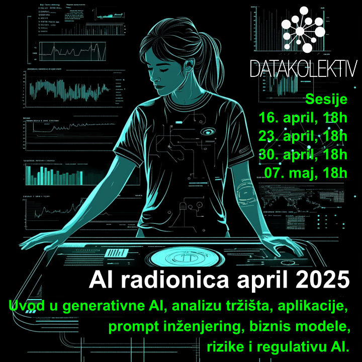

## Beograd, online 
## Google Meet/Slack/GitHub

---

### **🚀 Prijavite se na [AI Workshop April 2025](https://forms.gle/RAQxDkwnZzu71F2r8)**
### **📧 Kontakt na e-mail: [hello@datakolektiv.com](mailto:hello@datakolektiv.com)**

### **🚀 Prijavite se na [AI Workshop April 2025](https://forms.gle/RAQxDkwnZzu71F2r8)**

# Cena **400€**

**Očekivani tehnički background: NULA - dovoljno je interesovanje za AI tehnologije.** Ovo **nije tech radionica** i primarno je orijentisana na razumevanje tržišta, aplikacija, i procesa u savremenim AI tehnologijama. Sve što treba da znate o samim AI tehnologijama da biste zakoričili u svet poslovanja ili plasmana na njima baziranih proizvoda - objasnićemo vam mi!

---

### Šta treba da znamo o AI tehnologijama da bismo pokrenuli biznis sa njima, unapredili već postojeće poslovanje, ili ih maksimalno iskoristili u našem svakodnevnom radu? **DataKolektiv AI Workshop daje odgovore upravo na ova pitanja - a odgovore ćete dobiti od [čoveka koji uspešno vodi AI timove u međunarodnim startapima, na evropskoj Data Science/ML sceni je više od deset godina, i monetizuje AI tehnologije od kako su se savremene generativne AI poput ChatGPT uopšte pojavile.](https://www.linkedin.com/in/gmilovanovic/)**

### Ciljevi radionice: šta će učesnici naučiti

Posle radionice, učesnici će će

- biti u stanju da razviju svoje biznis ideje bazirane na AI tehnologijama,
- razumejući dobro sve povezane poslovne rizike,
- razumejući regulativu i potencijalna ograničenja,
- razumejući odnose na tržištu kako bi pronašli nišu u kojoj njihova ideja može da radi; 
- biće u stanju da sami koriste efikasno i kompetentno AI sisteme u svom radu zahvaljujući poznavanju veštine prompt engineering-a;
- biće u stanju da unaprede svoje trenutno poslovanje inteligentnom i efikasnom primenom AI tehnologija u postojećim procesima.

**Radionica pokriva četiri celine:**

- razumevanje principa na kojima počivaju AI tehnologije,
- analiza tržišta odn. ponude i potražnje na AI tržištu,
- biznis modeli za AI proizvode i projekte,
- praktične veštine (Prompt Engineering) u upotrebi AI u poslovanju i radu.

Tokom radionice formulisaćemo jedan business case i simulirati njegov razvoj. Ta simulacija se proteže kroz sve sesije radionice i prati naš celokupan rad kao materijal za neposrednu demonstraciju znanja i veština koja će polaznici sticati.

Posebna pažnja će biti posvećena regulaciji AI sistema, pošto će u bliskoj budućnosti regulatorni okviri za AI svakako biti nešto bez čega poslovni razvoji neće biti mogući, sa naglaskom [AI Act](https://artificialintelligenceact.eu/) Evropske unije.

Postoji opciona, peta celina i sesija, za one koji znaju malo Python i interesuje ih da nauče da koriste generativne AI kroz API (OpenAI, Anthropic, DeepSeek...).

## **Kako radimo na ovoj radionici?**

- Vidimo se u **online** na četiri (4) sesije u trajanju 2h - 2h30' svaka;
- Sesije se organizuju 16. aprila, 23. aprila, 30. aprila, i 7. maja, sa početkom u 18h; 
- posle svake sesije nastavljamo **asinhrono, online, na platformi Slack** gde će biti formiran poseban kanal za ovu radionicu, i gde narednih nedelju dana imate poptuno besplatnu, real-time podršku za sva pitanja koja ćete imati ili use-cases koje testirate;
- biće podeljeni **detaljni materijali za učenje, diskusiju i dalji razvoj**;
- ko se opredeli i da malo programira u Python sa nama, **dobija tri elaborirana Notebook za učenje automatizacije Prompt Engineering kroz OpenAI GPT klasu modela**.

---

## **[!!!]Ograničen broj polaznika i personalizacija**

DataKolektiv **nikada** ne radi sa velikim brojem polaznika, zato što tokom učešća na našim radionicama i kursevima **personalizujemo rad prema vašim potrebama!** To garantuje da ćete sa nama provesti dovoljno vremena u radu i moći da diskutujete uživo i online **baš sva pitanja koja budete imali**, razmenite ideje sa nama - i čak kodirate zajedno sa nama ukoliko želite u pair-programming sesijama. **Po završteku radionice mi ćemo vam stajati na raspolaganju za besplatne online konsultacije narednih 7 dana**, za sva pitanja koja ćete imati ili use-cases koje biste želeli da testirate. **DataKolektiv radi već godinama po ovoj metodologiji i to nam omogućava da se svakom polazniku posvetimo maksimalno i precizno u skladu sa njegovim potrebama!**

---

## **Predavač**

[Dr Goran S. Milovanović](https://www.linkedin.com/in/gmilovanovic/), Chief AI Officer, [smartocto](), vlasnik [DataKolektiv](https://datakolektiv.com/). Studirao matematiku, filozofiju, i psihologiju, na Beogradskom i Njujorškom (NYU) univerzitetu, doktorirao psihologiju. Programer od svoje desete godine, objavio prvi naučni rad sa dvadeset godina, sarađivao sa vrhunskim kognitivnim naučnicima i objavljivao radove citirane u *Stevens' Handbook of Experimental Psychology*. Višegodišnje iskustvo u analitici i mašinskom učenju na nekim od najvećih sistema podataka u svetu (Wikidata), član programskih odbora evropskih konferencija u Data Science. Kao individualni konsultant, u saradnji sa američkim edu startups, i sa DataKolektiv obrazovao je desetine ljudi za rad u Data Science i ML. U biznisu analitike od 90-ih, kroz sve faze koje je prošla od Quantitative Analytics, Data Mining, Data Science, ML, do AI. Osim što vodi DataKolektiv, on je Chief AI Officer u Smartocto gde vodi Data/LABS tim i razvija sve ML i AI projekte u ovom holandsko-srpskom startapu. 

---

## **Šta nosimo kući?**

Biće podeljeni kompletni materijali sa radionice, uključujući:

- Uvod u generativnu AI (slide-deck)
- Konceptualni pregled arhitekture GPT modela (slide-deck)
- Pregled svih postojećih OpenAI i Anthropic modela, objašnjenja njihove primene (HTML Notebook)
- Pregled biznis modela u AI tehnologijama
- Kompletna analiza trenutnog stanja tržišta u AI
- Detaljan Prompt Engineering trening (praktično sve što se o Prompt Engineering danas uopšte zna, HTML Notebook)
- Kompletan pregled postojećih online resursa za Prompt Engineering, od uvodnih do ekspertskih materijala (HTML Notebook)
- Kompletne Reading i Video liste za dalji rad i učenje (HTML Notebook)
- Kompletna tri Notebook u Python za obuku u radu sa OpenAI API (Jupyter Notebook)

---

## **Cena**

Cena je **400€** u dinarskoj protivvrednosti, a postoji popust od 10% za grupe polaznika (dve i više prijave već čine grupu polaznika; napomenite u vašim prijavama da se prijavljujete kao grupa).

---

## **Prijava**

### **🚀 Prijavite se na [AI Workshop April 2025](https://forms.gle/RAQxDkwnZzu71F2r8)**

