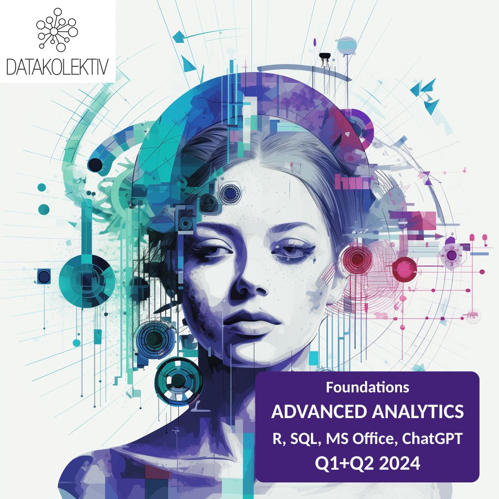

[](https://github.com/datakolektiv)&nbsp;&nbsp;[](https://www.linkedin.com/company/datakolektiv/)

Kompletna plejlista kursa [Uvod u programski jezik R](https://datakolektiv.com/app_direct/uvodr/) koji sam održao u saradnji sa [Startit](https://startit.rs/).

- Kurs prati kod na sledećim stranicama: [Uvod u R programiranje za analizu podataka](https://datakolektiv.com/app_direct/uvodr/)

- Link na YouTube plejlistu: [Uvod u programski jezik R](https://www.youtube.com/playlist?list=PLji_uE7buef9bugJOnn4vwef_rz46rQeh) 

- Ovaj kurs predstavlja odličnu pripremu za DataKolektiv *pro kurs* [ADVANCED ANALYST :: Foundations for Advanced Data Analytics in R](https://www.datakolektiv.com/app_direct/DataKolektivServer/DataKolektiv_AdvancedAnalyst_R-Track.pdf).

- Na ovom kursu se fokusiram više na same osnove R programiranja nego na analitiku i modeliranje; u raznim verzijama ovaj kurs sam održao u saradnji sa Startit volonterski, a pohađale su ga desetine polaznika sa interesovanjem da započnu karijere u Data Analytics i Data Science.

<br>

**Uvod u programski jezik R - Lekcija 1**

```{r echo = FALSE}
library(vembedr)
embed_url("https://www.youtube.com/watch?v=EnQo_WDH1L0&list=PLji_uE7buef9bugJOnn4vwef_rz46rQeh&index=1")
```

**Uvod u programski jezik R - Lekcija 2**

```{r echo = FALSE}
embed_url("https://www.youtube.com/watch?v=FKeCNePwo94&list=PLji_uE7buef9bugJOnn4vwef_rz46rQeh&index=2")
```

**Uvod u programski jezik R - Lekcija 3**

```{r echo = FALSE}
embed_url("https://www.youtube.com/watch?v=gfQt01cJ3as&list=PLji_uE7buef9bugJOnn4vwef_rz46rQeh&index=3")
```

**Uvod u programski jezik R - Lekcija 4**

```{r echo = FALSE}
embed_url("https://www.youtube.com/watch?v=R7KtxdMDhSE&list=PLji_uE7buef9bugJOnn4vwef_rz46rQeh&index=4")
```

**Uvod u programski jezik R - Lekcija 5**

```{r echo = FALSE}
embed_url("https://www.youtube.com/watch?v=XWsPC3W7HBE&list=PLji_uE7buef9bugJOnn4vwef_rz46rQeh&index=5")
```

**Uvod u programski jezik R - Lekcija 6**

```{r echo = FALSE}
embed_url("https://www.youtube.com/watch?v=K9jPCe4SqzY&list=PLji_uE7buef9bugJOnn4vwef_rz46rQeh&index=6")
```

**Uvod u programski jezik R - Lekcija 7**

```{r echo = FALSE}
embed_url("https://www.youtube.com/watch?v=KJQC7XaHcV4&list=PLji_uE7buef9bugJOnn4vwef_rz46rQeh&index=7")
```

---

*Od svog osnivanja 2017. godine, DataKolektiv je obučio mnoge u oblasti Data Science i Machine Learning. Naše saradnje uključuju vodeće naučne institucije, desetine stručnjaka za tržišna istraživanja, iskusne softverske inženjere koji prelaze na ML/AI, menadžere proizvoda iz vodećih banaka i kompanija na zapadnoevropskom tržištu, studente i postdiplomce koji ulaze na tržište rada, entuzijaste, poslovne analitičare, pa čak i iskusne stručnjake za ML/AI. Prijavite se na naše kurseve da biste saznali zašto: iako neki kažu da su izazovni, mi verujemo da nema prečice do uspeha. Održavamo besprekoran uspeh jer se povezujemo i služimo samo liderima i uspešnim ljudima.*

--- 

**[NEW] ADVANCED ANALYST :: Foundations for Advanced Data Analytics in R**

- [Course Info](DataKolektiv_AdvancedAnalyst_R-Track.pdf) 

- **APPLY to [hello@datakolektiv.com](mailto:hello@datakolektiv.com) directly**

[](DataKolektiv_AdvancedAnalyst_R-Track.pdf)

