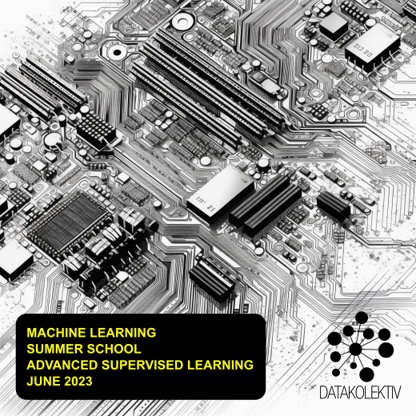
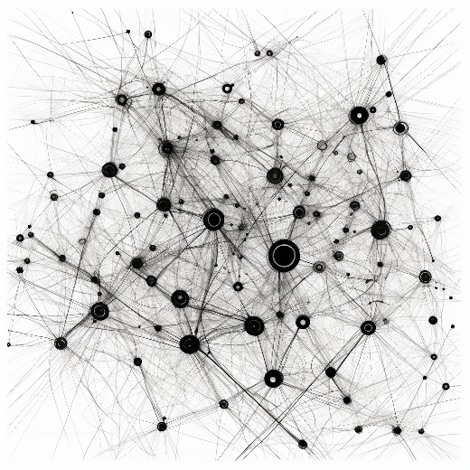

## June 2023, Hybrid Online// Slack/GitHub/Video + Belgrade meet-ups

### A complete introduction to the principles of supervised learning from linear models and decision trees to neural networks. Everything you need to know about model selection and control in regression and classification problems in business analytics. Programming language: R or Python (or both; your choice).

---

### **>> Apply: [hello@datakolektiv.com](mailto:hello@datakolektiv.com) <<**

Send us an email, a few words about yourself, and we will respond with a request for more detailed information necessary to register for the Summer School and answer any questions you may have before the fun begins!

### **>> Apply by sending an e-mail to: [hello@datakolektiv.com](mailto:hello@datakolektiv.com) <<**

### **EUR 850 for applications received by May 25, 2023** and **EUR 1000** for applications received after that date.

---

## **Goals**

After completing the ML Summer School 23 with us, you will be able to

- use regularized linear and generalized linear models to solve regression and classification problems;

- use Decision Trees, Random Forests and Gradient-Boosted Trees models to solve regression and classification problems;

- carry out the complete model selection procedure;

- adopt the basics of Bayesian Inference to conduct controlled A/B tests;

- lay the foundations for understanding and working with backpropagation neural networks so that you can adopt Deep Learning methods in your further education and work.

---

## **ML/Data Science are endlessly interesting (and promising)**

Those who are good at these fields are those who can love them, know how to take an engineering approach to problems, are curious and want to unlock the value of the huge amounts of data the world creates every day. ML is already a central part of many products in IT in general, and has long been a core part of business analytics.

The gap between demand and supply of qualified personnel in the market is **unbelievable**, which makes this an **excellent career choice**. Take a look at how long data science job postings stay open and you'll be able to imagine how difficult it is to find the right person for such a job.

---

## **[!!!]Limited number of attendees and personalization**

[DataKolektiv](https://datakolektiv.com/app_direct/DataKolektivServer/index.html) **never** works with a large number of participants, because during participation in our courses we **personalize the work according to your needs!** This guarantees that you will spend enough time working with us and be able to discuss live and online **any questions you may have**, exchange ideas with us - and even code together with us in pair-programming sessions. For example, during this course we will have several live sessions, but in addition we are available online practically non-stop on weekdays on the course Slack channel and GitHub where we do *code review* for you, advise you, share supplementary materials, organize 1: 1 consultation on Google Meet when necessary, teamwork in small groups, and of course we answer all your questions! :-) **DataKolektiv has been working for years according to this methodology, and this allows us to dedicate ourselves to each participant as much as possible and precisely in accordance with their needs!**

---

## **What do we do specifically?**

**At [DataKolektiv](https://datakolektiv.com/app_direct/DataKolektivServer/index.html) we are quite pragmatic and our approach is completely, totally practical: our goal is that at the end of the course you simply know how to solve a problem in front of you! We teach mathematical basics, but only to the level that is necessary for understanding modeling in ML and Data Science; everything else you learn by learning to program something, and you develop and test your knowledge on practical examples and discuss with us. We are an experienced consultancy in ML and Data Science, we have served some of the largest data providers in the world in general and leading European banks, and when you learn with us, you learn the same thing that we do for our clients and charge them.**

---

## **Lecturers**

[Goran S. Milovanović, Phd](https://www.linkedin.com/in/gmilovanovic/). Studied mathematics, philosophy, and psychology at Belgrade and New York (NYU) university, received a doctorate in psychology. A programmer since the age of ten, he published his first scientific paper at the age of twenty, collaborated with top cognitive scientists and published papers cited in Stevens' Handbook of Experimental Psychology. Many years of experience in analytics and machine learning on some of the largest data systems in the world ([Wikidata](https://www.wikidata.org/wiki/Wikidata:Main_Page)), member of the program boards of European conferences in Data Science. As an individual consultant, in cooperation with American edu start-ups, and with [DataKolektiv](http://www.datakolektiv.com/app_direct/DataKolektivServer/), he trained dozens of people to work in Data Science and ML. Founder and current President of [MACHINERY](https://www.linkedin.com/company/machineryorg/), the Serbian association of professionals in Data Science and Engineering, Machine Learning, and AI.

[Ilija Lazarevic, MSc](https://www.linkedin.com/in/ilijalazarevic/). Completed a master's degree in informatics at the University of Kragujevac, participated in classes on the subject Operating Systems. Many years of experience in the positions of software engineer and machine learning engineer, specialist in (a) problems of automatic pricing in the field of real estate on the international market, and (b) development of recommendation engines in the field of casino games. Founding member of [MACHINERY](https://www.linkedin.com/company/machineryorg), the Serbian association of professionals in Data Science and Engineering, Machine Learning, and AI.

---

## **ML Summer School 23 Program**

- **Week 01**
   - Linear Models I: Optimization, Regularization, and Cross-Validation of Linear Models for regression problems
   - Estimation Theory I: Least Squares estimation
   
- **Week 02**
   - Linear Models II: Optimization, Regularization, and Cross-Validation of Generalized Linear Models for classification and regression problems
   - Estimation Theory II: Maximum Likelihood Estimation
   - Model Selection: ROC Analysis, Goodness-of-Fit and Badness-of-Fit measures

- **Week 03**
   - Decision Trees for regression and classification problems
   - Ensemble Models: Random Forests and Gradient Boosted Decision Trees (XGBoost)

- **Week 04**
   - Introduction to Bayesian Inference: Conjugate Priors, Bayesian A/B testing from a Beta-Binomial Inference
   - Introduction to Neural Networks: Backpropagation Algorithm and Gradient Descent

---

## **What do our participants write about our courses?**

See what former participants of [DataKolektiv courses](https://datakolektiv.com/app_direct/DataKolektivServer/courses.html) say about us on our [Testimonials](https://www.datakolektiv.com/app_direct/DataKolektivServer/about.html#testimonials) page. All the Data Science professionals you see on this page can be directly contacted via their LinkedIn profiles listed there and asked to directly share their experiences from our courses with you!

---

## **Prerequisites**

It's an *intensive, advanced course in Machine Learning in Python and R*, so...

- The ML Summer School is not an introductory course in Data Science and Machine Learning like our [DATA SCIENCE SESSIONS Foundational Course](https://datakolektiv.com/app_direct/introdsnontech/); this Summer School is recommended for final year students or postgraduates in STEM fields (natural sciences, technical faculties, computer science, engineering); if you are applying from a social science degree, we recommend that you thoroughly check your knowledge of mathematics before deciding to participate in the work of the ML Summer School 23;

- knowledge - at least introductory - of programming in R or Python is necessary;

- knowledge of the basics of probability theory and statistics is necessary;

- knowledge of at least basic calculus, logarithmic and exponential functions, probability, and derivatives, as well as the basics of Linear Algebra (operations with vectors and matrices) is necessary;

- **motivation, good will, positive emotion, and desire for success** are definitely things you should pack with you and bring to the course.

---

## **Pricing**

The price of the summer school is **EUR 850 for applications received by May 25, 2023** and **EUR 1000** for applications received after that date.

---

## **Application**

### **>> Please apply by sending an e-mail to: [hello@datakolektiv.com](mailto:hello@datakolektiv.com) <<**.

Send us an email, a few words about yourself, and we will respond with a request for more detailed information necessary to register for the course and answer any questions you may have before the course begins!
