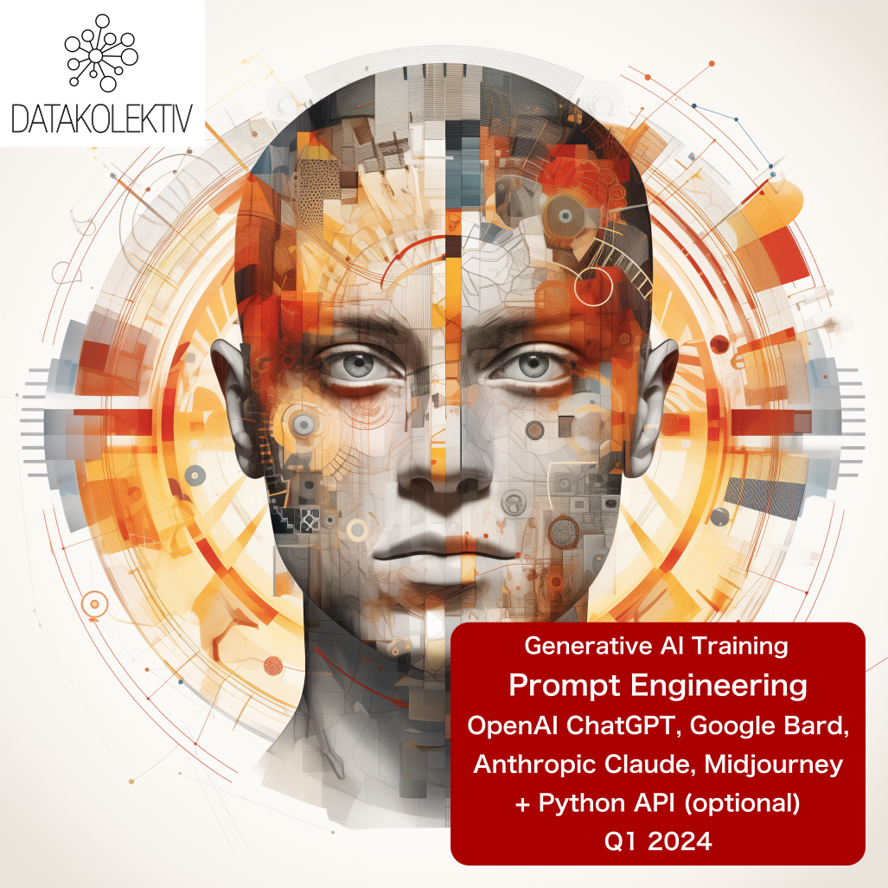
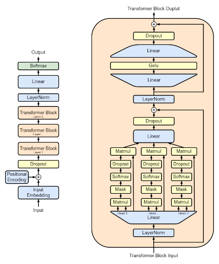

## Online 4 (+1 optional Python) sessions ~ 12hours 
## + 7 days Slack/GitHub support for your project
## Understand Generative AI + Master OpenAI ChatGPT

---

### **>> SIGN UP via e-mail: [hello@datakolektiv.com](mailto:hello@datakolektiv.com) <<**

### **>> SIGN UP via e-mail: [hello@datakolektiv.com](mailto:hello@datakolektiv.com) <<**

# Price **350€**

---

### **November 2023 UPDATE: Following the [latest updates from OpenAI](https://www.youtube.com/live/U9mJuUkhUzk?si=-NUuQqADc24XVrCa) the Workshop now includes a thorough explanation on how to create your own GPT chatbot or virtual assistant and use it for your purposes.**

### **NEW: The workshop is now expanded to four (4) sessions of 3 hours each and includes a complete study of the project application or service relying on generative AI - fulfilling the demands of people with a non-tech background who manage teams or work on the product side.**

## **Why should we learn about Prompt Engineering?**

- In the [*The state of AI in 2023: Generative AI’s breakout year (August 2023)*](https://www.mckinsey.com/capabilities/quantumblack/our-insights/the-state-of-ai-in-2023-generative-AIs-breakout-year) research, **McKinsey & Company** state: "... a much smaller portion of respondents report employing software engineers associated with AI - a role that was the most commonly employed last year - than in the previous survey (**28%** in the latest survey, **down from 39%**). Roles in prompt engineering have recently emerged, **as the need for this skill set grows along with the adoption of generative AI, with 7% of respondents from organizations that have adopted AI reporting such hiring in the past year.**"

- Because the Prompt Engineering position will be **increasingly prevalent as companies adopt generative AI technologies** - and they are adopting them extensively!

- Because systematic understanding and practice in the use of generative AI technologies (like **OpenAI (Chat)GPT** - but not limited to it) enable you to seriously save time spent at work.

- Because by understanding and practicing with this technology, you gain a good **professional status** in any industry as there clearly is no future of work without assistive, generative AI.

- Because **entire new categories of professions** will emerge in which people who are fundamentally not developers nor software engineers will do jobs that will essentially be very similar - **but through prompt engineering.** What is now one profession - Prompt Engineer - **will soon be many different professions** all involving prompt engineering as a basic skill!

- Because the current OpenAI GPT-3.5 (free ChatGPT model) and GPT-4 are already in widespread use, and there is already eager anticipation for the launch of GPT-5 in 2024 – **so the time to learn is now.**

## **How do we work in this workshop?**

- We meet **online** for four (4) sessions lasting 2.5h - 3h;
- afterwards, we continue **asynchronously, online, on the Slack platform** where a special DataKolektiv channel will be formed for this workshop, and where you have completely free, real-time support for any questions you may have or use-cases you are testing for the following week;
- **detailed learning materials and further development in Prompt Engineering** will be shared;
- those who opt to do a bit of programming in Python with us, **receive three elaborated Notebooks for learning automation of Prompt Engineering through the OpenAI GPT class of models**.

---

## **What will we do in the Prompt Engineering workshop?**

Do I need to understand this to operate GPT models?

**No.** In **1/4** of our workshop, we will provide a *conceptual overview of the principles* on which all generative models for natural language are based; minimal knowledge of mathematics will not be required (but we will guide those interested in how to learn such things).

**Understanding these principles is, however, very important**: it allows us to understand the limits of such technologies, to know what, how, and why we can ask of them, why they "hallucinate" and what "hallucinations" are, what are the "emergent properties" of such systems, and more - what to expect from such technologies, and what not.

---

In **2/4** of our work, we completely focus on the latest knowledge in the skill of Prompt Engineering:

- How is a good prompt designed in general?
- What are the constituents of every good prompt?
- What types of prompts exist?
- When to use which type of prompt:
   - Zero-shot prompting
   - One-shot and few-shot prompting
   - Chain-of-thought prompting (CoT)
   - ReAct Prompting
   - Coding prompts
   - Analytical prompts: how to make the GPT model your analyst
- Basics of cybersecurity in Prompt Engineering: what not to do

---

What are **hallucinations** in generative AI models, why do they occur, and how can we control them?

---

In **3/4** of our work, we continue with understanding and practicing Prompt Engineering based on the studied techniques, but also provide insight into the complete spectrum of OpenAI GPT models:

- What models exist?
- What is each OpenAI GPT model used for? Which task should be specifically solved with which model, and how?
- What are the ways to access these models, and at what prices? How to estimate the cost of a specific request? What are tokens and how do GPT models tokenize our prompts?
- Direct examples: prompts, tokenization (we will explain what this is), and costs.

---

In **4/4** of our work (optional; for listeners who are attracted to Python programming, although we advise everyone to participate in this part of the workshop) we move on to working with the OpenAI API through the Python programming language:

- Minimal knowledge of Python for automating Prompt Engineering through the OpenAI API;
- OpenAI API endpoints, tokenization, costs, moderation endpoint (very important for developing 3rd party apps);
- Automated Prompt Engineering through Python;
- Accepting results in JSON, XML, CSV formats;
- Fine-tuning GPT models for text classification;
- Working with embeddings from OpenAI models;
- Overview of resources for further learning;
- Overview of the complete architecture for developing AI apps and services (LangChain, Prompt Engineering, Vector Databases).

---

## **[!!!]Limited number of participants and personalization**

DataKolektiv **never** works with a large number of participants, because during participation in our workshops and courses **we personalize the work according to your needs!** This guarantees that you will spend enough time working with us and be able to discuss **all the questions you have** live and online, exchange ideas with us - and even code together with us if you wish in pair-programming sessions. **After completing the workshop, we will be available for free online consultations for the next 7 days**, for any questions you may have or use-cases you would like to test. **DataKolektiv has been working for years with this methodology, and it allows us to devote ourselves maximally and precisely to each participant according to their needs!**

---

## **Lecturer**

[Dr. Goran S. Milovanović](https://www.linkedin.com/in/gmilovanovic/). Studied mathematics, philosophy, and psychology at the University of Belgrade and New York University (NYU), with a PhD in psychology. A programmer since the age of ten, he published his first scientific paper at the age of twenty, collaborated with top cognitive scientists, and published works cited in *Stevens' Handbook of Experimental Psychology*. Has years of experience in analytics and machine learning on some of the world's largest data systems (Wikidata), and is a member of program committees for European Data Science conferences. As an individual consultant, in collaboration with American educational startups and DataKolektiv, he has educated dozens of people in Data Science and ML. Besides leading DataKolektiv, he is the Lead Data Scientist at Smartocto, where he heads the LABS team and develops all ML and AI projects in this Dutch-Serbian startup. 

---

## **What do we take home?**

Complete materials from the workshop will be shared, including:

- Introduction to generative AI (slide-deck)
- Conceptual overview of GPT model architecture (slide-deck)
- Review of all existing OpenAI GPT models, explanations of their applications (HTML Notebook)
- Detailed Prompt Engineering training (practically everything that is currently known about Prompt Engineering, HTML Notebook)
- A complete overview of existing online resources for better Prompt Engineering, from introductory to expert materials (HTML Notebook)
- Complete Reading and Video lists for further work and learning (HTML Notebook)
- Three complete Python Notebooks for training in working with the OpenAI API (Jupyter Notebook)

---

## **Price**

The price is **only 350€** with a **10% discount for groups of participants** (two or more applications already form a group of participants; mention in your applications that you are applying as a group).

---

## **Registration**

### **>> SIGN UP via e-mail: [hello@datakolektiv.com](mailto:hello@datakolektiv.com) <<**

