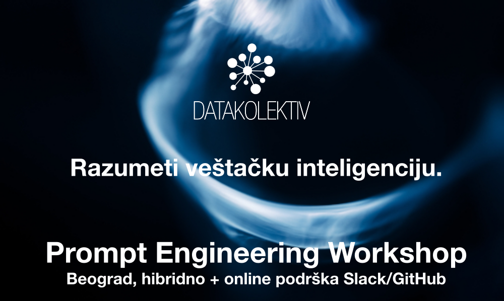

## Beograd, hibridno online/uživo 
## Online Slack/GitHub podrška 7 dana

---

### **>> Prijavite se na: [hello@datakolektiv.com](mailto:hello@datakolektiv.com) <<**

### **>> Prijavite se na: [hello@datakolektiv.com](mailto:hello@datakolektiv.com) <<**

# Cena **350€**

---

## **Zašto treba da učimo o Prompt Engineering?**

- U [*The state of AI in 2023: Generative AI’s breakout year (avgust 2023)*](https://www.mckinsey.com/capabilities/quantumblack/our-insights/the-state-of-ai-in-2023-generative-AIs-breakout-year) istraživanju, **McKinsey & Company** navode: "... mnogo manji deo ispitanika prijavljuje zapošljavanje softverskih inženjera povezan sa AI - ulogu koja je bila najčešće zapošljavana prošle godine - nego u prethodnoj anketi (**28%** u najnovijoj anketi, **smanjenje sa 39%**). Uloge u prompt inženjeringu su se nedavno pojavile, **jer potreba za tim skupom veština raste zajedno sa usvajanjem generativne AI, sa 7% ispitanika iz organizacija koje su usvojile AI koji prijavljuju takva zapošljavanja u protekloj godini.**" 

- Zato što će Prompt Engineering pozicija u budućnosti biti **sve više kako kompanije usvajaju generativne AI tehnologije** - a usvajaju ih naveliko!

- Zato vam što sistematsko razumevanje i praksa u upotrebi generativnih AI tehnologija (poput **OpenAI (Chat)GPT** - ali ne samo nje) omogućavaju da ozbiljno uštedite vreme koje trošite u poslu.

- Zato što ćete razumevanjem i praksom rada sa ovom tehnologijom steći dobar **profesionalni status** u ma kojoj industriji jer očigledno nema budućnosti rada bez asistivnih, generativnih AI.

- Zato što će nastati **čitave nove kategorije profesija** u kojima će ljudi koji suštinski nisu developeri niti softverski inženjeri raditi poslove koji će suštinski biti veoma slični tome - **ali kroz prompt inženjering.** Ono što je sada jedna profesija - Prompt Engineer - **će uskoro biti mnogo različitih profesija** koje će sve podrazumevati prompt inženjering kao osnovnu veštinu!

- Zato što su sada aktualni OpenAI GPT-3.5 (besplatni ChatGPT model) i GPT-4, a već se nestrpljivo čeka da u decembru 2023 krene i GPT-5 – **tako da je vreme za učenje sada.**

## **Kako radimo na ovoj radionici?**

- Vidimo se u **Beogradu (location TBA) ili online** od 10:00 do 20:00, sa pauzom za ručak između 14:00 i 15:30;
- posle toga nastavljamo **asinhrono, online, na platformi Slack** gde će biti formiran poseban DataKolektiv kanal za ovu radionicu, i gde narednih nedelju dana imate poptuno besplatnu, real-time podršku za sva pitanja koja ćete imati ili use-cases koje testirate;
- biće podeljeni **detaljni materijali za učenje i dalji razvoj u Prompt Engineering**;
- ko se opredeli i da malo programira u Python sa nama, **dobija tri elaborirana Notebook za učenje automatizacije Prompt Engineering kroz OpenAI GPT klasu modela**.

---

## **Šta ćemo da radimo na Prompt Engineering radionici?**

Da li moram ovo da razumem da bih baratao GPT modelima?

**Ne.** U **1/4** našeg rada na radionici daćemo *konceptualni pregled principa* na kojima svi generativni modeli za prirodni jezik počivaju; ni minimalno poznavanje matematike neće biti zahtevano (ali ćemo zainteresovane uputiti na to kojim putem se ovakve stvari uče).

**Razumevanje samih principa je, ipak, veoma važno**: ono nam omogućava da razumemo granice ovakvih tehnologija, da znamo šta, kako i zašto možemo da od njih tražimo, zašto "haluciniraju" i šta su to uopšte "halucinacije", šta su to "emergentne osobine" ovakvih sistema, i drugo - šta od ovakvih tehnologija da očekujemo, a šta ne.

---

U **2/4** našeg rada potpuno se fokusiramo na najnovija saznanja veštinu Prompt Engineering-a:

- Kako se, u celini, dizajnira dobar prompt? 
- Koji su konstituenti svakog dobrog prompta?
- Koji sve tipovi promptova postoje?
- Kada treba koristiti koji tip prompta:
   - Zero-shot prompting
   - One-shot i few-shot prompting
   - Chain-of-thought prompting (CoT) 
   - ReAct Prompting   
   - Coding prompts
   - Analytical prompts: kako da GPT model postane vaš analitičar
- Osnove sajberbezbednosti u Prompt Engineering: šta ne treba raditi

---

Šta su **halucinacije** u generativnim AI modelima, zbog čega nastaju, i kako možemo da ih kontrolišemo?

---

U **3/4** rada nastavljamo sa razumevanjem i uvežbavanjem Prompt Engineering po proučenim tehnikama, ali i pružamo uvid u kompletan spektar OpenAI GPT modela:

- Koji sve modeli postoje?
- Čemu koji OpenAI GPT model služi? Koji zadatak treba spefično rešavati kojim modelom, i kako?
- Koji su načini pristupa ovim modelima, i po kojima cenama? Kako proceniti koštanje tačno kojeg zahteva? Šta su tokeni i kako GPT modeli tokenizuju naše promptove?
- Neposredni primeri: promptovi, tokenizacija (objasnićemo šta je to), i cene.

---

U **4/4** rada (opciono; za slušaoce koje privlači Python programiranje, mada mi savetujemo svima da uzmu učešća i u ovom delu radionice) prelazimo na rad sa OpenAI API kroz programski jezik Python:

- minimalno poznavanje Python za automatizaciju Prompt Engineering kroz OpenAI API; 
- OpenAI API end-points, tokenizacija, cene, moderation end-point (veoma važno za razvoj 3rd party apps);
- automatski Prompt Engineering kroz Python;
- prihvatanje rezultata u JSON, XML, CSV formatima;
- fine-tune GPT modela za klasifikaciju teksta;
- rad sa embeddings iz OpenAI modela;
- pregled resursa za dalje učenje;
- pregled LangChain framework za razvoj AI apps i kompletne arhitekture (LangChain, Prompt Engineering, Vector Databases).

---

## **[!!!]Ograničen broj polaznika i personalizacija**

DataKolektiv **nikada** ne radi sa velikim brojem polaznika, zato što tokom učešća na našim radionicama i kursevima **personalizujemo rad prema vašim potrebama!** To garantuje da ćete sa nama provesti dovoljno vremena u radu i moći da diskutujete uživo i online **baš sva pitanja koja budete imali**, razmenite ideje sa nama - i čak kodirate zajedno sa nama ukoliko želite u pair-programming sesijama. **Po završteku radionice mi ćemo vam stajati na raspolaganju za besplatne online konsultacije narednih 7 dana**, za sva pitanja koja ćete imati ili use-cases koje biste želeli da testirate. **DataKolektiv radi već godinama po ovoj metodologiji i to nam omogućava da se svakom polazniku posvetimo maksimalno i precizno u skladu sa njegovim potrebama!**

---

## **Predavač**

[Dr Goran S. Milovanović](https://www.linkedin.com/in/gmilovanovic/). Studirao matematiku, filozofiju, i psihologiju, na Beogradskom i Njujorškom (NYU) univerzitetu, doktorirao psihologiju. Programer od svoje desete godine, objavio prvi naučni rad sa dvadeset godina, sarađivao sa vrhunskim kognitivnim naučnicima i objavljivao radove citirane u *Stevens' Handbook of Experimental Psychology*. Višegodišnje iskustvo u analitici i mašinskom učenju na nekim od najvećih sistema podataka u svetu (Wikidata), član programskih odbora evropskih konferencija u Data Science. Kao individualni konsultant, u saradnji sa američkim edu startups, i sa DataKolektiv obrazovao je desetine ljudi za rad u Data Science i ML. Osim što vodi DataKolektiv, on je Lead Data Scientist u Smartocto gde vodi LABS tim i razvija sve ML i AI projekte u ovom holandsko-srpskom startapu. 

---

## **Šta nosimo kući?**

Biće podeljeni kompletni materijali sa radionice, uključujući:

- Uvod u generativnu AI (slide-deck)
- Konceptualni pregled arhitekture GPT modela (slide-deck)
- Pregled svih postojećih OpenAI GPT modela, objašnjenja njihove primene (HTML Notebook)
- Detaljan Prompt Engineering trening (praktično sve što se o Prompt Engineering danas uopšte zna, HTML Notebook)
- Kompletan pregled postojećih online resursa za bolji Prompt Engineering, od uvodnih do ekspertskih materijala (HTML Notebook)
- Kompletne Reading i Video liste za dalji rad i učenje (HTML Notebook)
- Kompletna tri Notebook u Python za obuku u radu sa OpenAI API (Jupyter Notebook)

---

## **Cena**

Cena je **samo 350€** u dinarskoj protivvrednosti, a postoji popust od 10% za grupe polaznika (dve i više prijave već čine grupu polaznika; napomenite u vašim prijavama da se prijavljujete kao grupa).

---

## **Prijava**

### **>> Prijavite se na: [hello@datakolektiv.com](mailto:hello@datakolektiv.com) <<**

