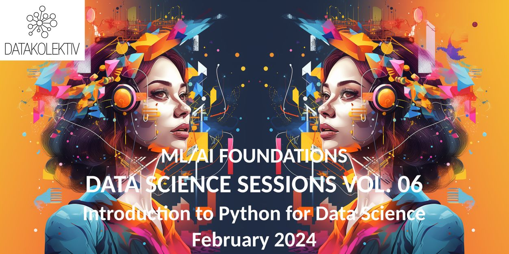

&nbsp;&nbsp;

**DataKolektiv's Foundational Data Science courses in Python and R have helped dozens enter Data Science, Machine Learning, AI, and Analytics. It is hard work though.**

 

 

**The triad of learning at DataKolektiv:**

- **FOUNDATIONS**|Data Science, ML/AI Foundations: From Mathematical Concepts to Machine Learning Models. Duration: 12-24 weeks, intensive in-person course with online support.

- **ANALYST**|Data Exploration & Visualization: Mastering Tools for Analytics. Duration: 6-8 weeks, hybrid online & in-person course.

- **BUSINESS**|Leadership Decisions in Data Science, ML/AI: Roles, Risks, and Transformations. Duration: 1-2 days in-person workshops with mentoring.

---

## FOUNDATIONS

**Foundational courses are offered in R and Python and differ only in the choice of the programming language.**

 

> [OPEN CALL FOR WINTER/SPRING 2024 DATA SCIENCE SESSIONS PYTHON GROUP](https://www.datakolektiv.com/app_direct/DataKolektivServer/dss_vol06_introPy2024.html)

**For generations, experts and enthusiasts in Data Science, ML, and AI have been taking the foundational DATA SCIENCE SESSIONS course with DataKolektiv.** This is a *thorough, intensive, 12(in situ)/24(online) weeks* introductory course in **R or Python for Data Science**. This course requires a highly motivated participant and covers (a) mastering the programming languages Python or R, (b) an introduction to probability theory and mathematical statistics for Data Science and Machine Learning, (c) detailed work in exploratory analytics and data visualization, and (d) the application of all classic predictive modeling methods from linear, through generalized linear models, to Decision Trees and Random Forest. The course demands a minimum of eight hours per week, includes direct hands-on work with top experts proven in both academia and industry, and encompasses 2 - 6 hours of instruction weekly (depending on whether it's conducted live, hybrid, or fully online), work on weekly assignments, and practical work on project development. This is a foundational introduction to Data Science and Machine Learning that covers all the essential concepts of predictive analytics and is recommended for participants who are seriously interested in entering and working in this field. **Duration:** 12-24 weeks, intensive in-person course with online support.

- Data Science Sessions R track: [course website](http://datakolektiv.com/app_direct/introdsnontech)|[course repo](https://github.com/datakolektiv/sessions_introR)

- Data Science Sessions Python track: [course repo](https://github.com/datakolektiv/dss03python2023)

---

## ARTIFICIAL INTELLIGENCE & PROMPT ENGINEERING

[DataKolektiv AI Training/Prompt Engineering](https://www.datakolektiv.com/app_direct/DataKolektivServer/PE_2024.html).

This is a comprehensive, very popular DataKolektiv workshop that will take you from zero technical assumptions to understanding how generative AIs (like ChatGPT, Midjourney, and others) work, and then help you master the skill of Prompt Engineering with which you will achieve maximum efficiency in using such systems.

> [OPEN CALL FOR JANUARY/FEBRUARY 2024 AI TRAINING/PROMPT ENGINEERING WORKSHOP](https://www.datakolektiv.com/app_direct/DataKolektivServer/PE_2024.html)

 

---

## BUSINESS

**Leadership Decisions in Data Science, ML/AI: Roles, Risks, and Transformations.**Business workshops in Data Science, ML, and AI are organized on a per-need basis and are intended for decision-makers, managers, and leaders who want to learn and understand how predictive and exploratory technologies can enhance their products, services, and organization.**Duration:** 1-2 days in-person workshops with mentoring.

 

---

## ANALYST

**[NEW] ADVANCED ANALYST :: Foundations for Advanced Data Analytics in R**

- [Course Info](DataKolektiv_AdvancedAnalyst_R-Track.pdf) 

- **APPLY to [hello@datakolektiv.com](mailto:hello@datakolektiv.com) directly**

 

**Data Exploration & Visualization: Mastering Tools for Analytics**. Advanced analytics courses focus on exploratory data analysis, delve deeply into data visualization techniques, both statistical and interactive, on creating interactive reports, elementary predictive modeling and forecasting, interaction with Excel, PowerPoint, Tableau, and PowerBI from the R programming language, data extraction from various sources including PDF files, and the use of generative AI in an analyst's work. **Duration:** 12 weeks, hybrid online & in-person course. **These courses do not require prior programming knowledge.**

 

---

**[FREE - In Serbian] Checkout our [Introduction to R Programming](https://www.datakolektiv.com/app_direct/DataKolektivServer/IntroR.html)** - a free DataKolektiv course to help you layout some foundations in R before skipping to Data Analytics and Data Science.

---

*Since its inception in 2017, DataKolektiv has trained many in Data Science and Machine Learning. Our collaborations include top scientific institutions, dozens of market research experts, experienced software engineers transitioning to ML/AI, product managers from leading banks and companies in the Western European market, students and postgraduates entering the job market, enthusiasts, business analysts, and even seasoned experts in ML/AI. Sign up for our courses to find out why: while some say they are challenging, we believe there's no shortcut to success. We maintain an impeccable track record because we only associate with and serve leaders and achievers.*
