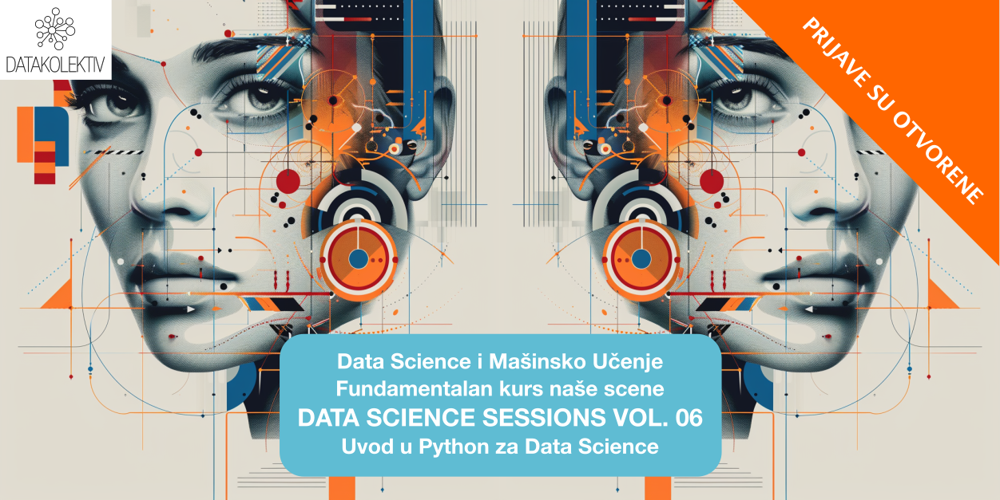
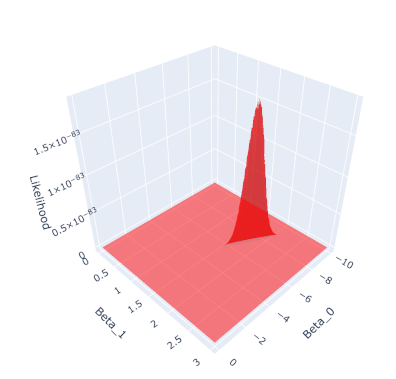

# **Uvod u Python za Data Science**
## Hibridno + Online: Slack/GitHub
### Susreti sa zajednicom: Beograd, po dogovoru

---

### **>> Prijavite se na: [hello@datakolektiv.com](mailto:hello@datakolektiv.com) <<**

### **>> Prijavite se na: [hello@datakolektiv.com](mailto:hello@datakolektiv.com) <<**

### Cena

Kurs u celini traje tri meseca i obuhvata (a) 24 tročasovne nastavne sesije, koje se organizuju subotom, po dve svake subote (prepodnevna i popodnevna sesija), (b) grupni sastanak za diskusiju važnih pitanja jednom nedeljno u trajanju od 1h, (c) komunikaciju u realnom vremenu na platformi Slack u vezi svih pitanja, i (4) ad hoc 1:1 sastanke u trajanju do 45 minuta sa predavačima ukoliko je polazniku neophodna pomoć koja zahteva neposredan, zajednički rad. Pauze u nastavi od dve ili tri nedelje se prave, okvirno, posle svake trećine kursa; tokom pauza je svakako omogućena komunikacija sa predavačima.

U slučaju da se kurs uzima modularno, način rada se opisan u prethodnom paragrafu se ne razlikuje, ali je moguće platiti svaki od tri modula kursa odvojeno, prema želji polaznika. Kurs obuhvata sledeća tri modula koji se predaju redom:

- **Modul 1.** Uvod u Python programiranje za Data Science, eksploratorna analitika podataka, osnove teorije verovatnoće
- **Modul 2.** Teorija verovatnoće i matematičke statistike za Data Science i mašinsko učenje, Teorija ocene, Baze podataka u Data Science, Linearni modeli
- **Modul 3.** Mašinsko učenje: Generalizovani linearni modeli, Model drveta odlučivanja, Random Forest model, Teorija selekcije modela

Polaznici koji smatraju da su dobro pripremljeni u programskom jeziku Python tako mogu da preskoče prvi modul i započnu sa nastavom od drugog modula, ili čak trećeg modula ukoliko smatraju da pored toga imaju i odgovarajuću pripremu u teoriji verovatnoće i matematičke statistike.

Svim zainteresovanima DataKolektiv savetuje da se pre odluke o tome da li će kurs uzimati u celini ili modularno jave kako bismo organizovali razgovor u kome možemo da objasnimo sve detalje ove ponude.

---

### **Klasičan Data Science kurs DataKolektiv koji su pohađale već generacije polaznika sada i u programskom jeziku Python. Desetina polaznika od 2020 godine postavilo je sa nama solidne u osnove u Data Science i mašinskom učenju, ubrajajući dvanest stručnjaka za marketinška istraživanja, produkt menadžere, analitičare, iskusne softverske inženjere koji rade na prekvalifikaciji u ML/AI, studente i postdiplomce na pragu tržišta rada, i čak iskusne stručnjake u ML/AI!**

Ovaj kurs je egzaktna replika našeg klasičnog [DATA SCIENCE SESSIONS](https://datakolektiv.com/app_direct/introdsnontech/) kursa u programskom jeziku R - **sada implementiranog u programskom jeziku Python na zahtev naših klijenata!** Tri meseca intenzivne obuke sa minimalnim pretpostavkama: od osnova Python programiranja, preko uvoda u matematičku statistiku nivoa neophodnog za Data Science, ka najbitnijim algoritmima mašinskog učenja u praksi + vizuelizacija podataka i izveštavanje.

## **Plan rada**

#### **Sesije uživo se održavaju subotama, u Beogradu ili online, 10:00 - 18:00 sa pauzom za ručak, dok radnim danima (ponedeljak - petak) radimo asihrono preko Slack platforme i na GitHub gde vodimo vaš samostalan rad, delimo vežbe i projekte, organizujemo 1:1 konsultacije, video calls kada su potrebni, i gde smo u realnom vremenu dostupni za pomoć, savete, i da odgovorimo na sva (baš sva) vaša pitanja.**

---

## **Ciljevi**

Pošto završite ovaj kurs sa nama, vi ćete moći da

- **usvojite podatke za rad** iz nekoliko različitih izvora (baza podataka, Internet, fajlovi na vašem računaru);
- **podatke pročistite i restruktuirate** tako da budu pripremljeni za potrebe analitike i/ili primenu mašinskog učenja na njima;
- **podatke vizuelizujete i uradite eksploratornu analizu podataka (EDA)**, postupak kojim ustanovljavate osnovne pravilnosti i izvlačite značajne uvide iz podataka;
- sa sigurnošću **rezonujete o rezultatima statističkih analiza, modela, i testova hipoteza**, uključujući naravno sve bitne forme popularnog **A/B testiranja**;
- primenite nekoliko različitih **modela mašinskog učenja za rešavanje regresionih i klasifikacionih problema** (ovakvi problemi pokrivaju 90% problema u oblasti poslovne analitike; naš kurs pokriva sve najbitnije algoritme mašinskog učenja za njihovo rešavanje);
- **napravite izveštaj** o rezultatima vašeg rada iz popularnog Jupyter Notebook sistema i prosledite ga u HTML ili PDF formatu vašim klijentima.

Drugim rečima, na ovom kursu prolazimo sve faze kompletnog projekta u Data Analytics i Data Science do nivoa softverskog inženjerstva AI rešenja (MLOps odn. plasiranja kompletnih ML baziranih aplikacija u produkciona okruženja, što je postupak koji jednostavno zahteva kurs za sebe). 

---

## **Izvesno onaj kurs u Data Science i ML u Python koji ste oduvek tražili**

Prema svim saznanjima koje imamo, ovaj intenzivan kurs Data Science i mašinskog učenja (ML) u Python za **je jedinstven u Srbiji**: prilagođen početnicima u Python programarinaju (ili, uz minimalnu pripremu, onima bez ikakvog predznanja) i imaju makar elementarno (srednjoškolsko) predznanje iz statistike i verovatnoće, naš **DATA SCIENCE VOL.04 :: Uvod u Python za Data Science** pruža priliku onima koji su spremni da posvete tri meseca nauci o podacima, vizuelizacijama i mašinskom učenju da kroz intenzivan, neposredan rad sa trojicom iskusnih eksperata u DataKolektiv savladaju rad u suštinskim paketima za Data Science u Python: [Numpy](https://numpy.org/) i [Scipy](https://scipy.org/), [Pandas](https://pandas.pydata.org/), [Statsmodels](https://www.statsmodels.org/stable/index.html), [Scikit Learn](https://scikit-learn.org/stable/), [Matplotlib](https://matplotlib.org/), [Seaborn](https://seaborn.pydata.org/), i [Plotly](https://plotly.com/). 

---

## **ML/Data Science su beskrajno interesantni (i perspektivni)**

U ovim oblastima su dobri oni koji mogu da ih zavole, znaju da uzmu inženjerski pristup problemima, radoznali su i žele da oslobode vrednost ogromnih količina podataka koje svet kreira svakodnevno. ML je već centralni deo mnogih proizvoda u IT-u uopšte, a odavno je sržni deo analitike poslovanja. 

Jaz između potražnje i ponude kvalifikovanog kadra na tržištu je **neverovatan**, što ovo čini **izvrsnim karijernim izborom**. Pogledajte koliko vremena ostaju otvoreni oglasi za poslove u Data Science pa ćete moći da zamislite koliko je teško naći pravu osobu za tako nešto.

Na ovom grafikonu se vidi kompletna funkcija verodostojnosti (engl. *Likelihood function*) jednostavnog linearnog regresionog modela. Zvuči komplikovano? To ćete vi da naučite da uradite u Python "na ruke" i razumete do detalja uz nas!

---

## **[!!!]Ograničen broj polaznika i personalizacija**

DataKolektiv **nikada** ne radi sa velikim brojem polaznika, zato što tokom učešća na našim kursevima **personalizujemo rad prema vašim potrebama!** To garantuje da ćete sa nama provesti dovoljno vremena u radu i moći da diskutujete uživo i online **baš sva pitanja koja budete imali**, razmenite ideje sa nama - i čak kodirate zajedno sa nama u pair-programming sesijama. Na primer, tokom ovog kursa imaćemo više celodnevnih sesija uživo, ali smo pored toga radnim danima praktično non-stop na raspolaganju online na Slack kanalu kursa i GitHub gde radimo *code review* za vas, savetujemo vas, delimo dopunske materijale, organizujemo 1:1 konsultacije na Google Meet kada je to potrebno, timski rad u malim grupama, i naravno odgovaramo na baš, baš sva vaša pitanja! :-) **DataKolektiv radi već godinama po ovoj metodologiji i to nam omogućava da se svakom polazniku posvetimo maksimalno i precizno u skladu sa njegovim potrebama!**

---

## **Šta radimo konkretno?**

Kompletna obuka za **(a)** osnove Python programiranja i upravljanje podacima (Numpy, Pandas, rad sa relacionim bazama podatka, preuzimanje podataka sa Interneta preko API poziva), **(b)** vizuelizacija podataka (statička i interaktivna) i izveštavanje o rezultatima kroz Jupyter Notebooks, **(c)** osnove teorije verovatnoće i matematičke statistike u Data Science, i **(d)** Machine Learning metode nadgledanog učenja (*Supervised Learning*) u programskom jeziku Python, sa studijama poslovnih problema u oblasti predikcije cena tržišta nekretnina, predikcije popularnosti online sadržaja, predikcije odlaska korisnika (churn) i drugih. Od linearne regresije do Random Forest modela - sve u danas sve više i više ubedljivo najpopularnijem programskom jeziku na svetu i u ovoj oblasti: Python. 

**U DataKolektiv smo prilično pragmatični i naš pristup je kompletno, totalno praktičan: cilj nam je da vi na kraju kursa jednostavno znate da neki problem pred sobom rešite! Matematičke osnove predajemo, ali isključivo do nivoa koji je neophodan za razumevanje modeliranja u ML i Data Science; sve ostalo učite tako što učite da to nešto isprogramirate, a vaše znanje razvijate i testirate na praktičnim primerima i diskutujete sa nama. Mi smo iskusna konsultanstka kuća u ML i Data Science, pružali smo usluge nekim od najvećih provajdera podataka na svetu uopšte i vodećim evropskim bankama, i kada učite sa nama, učite isto ono što mi radimo za naše klijente i naplaćujemo im: pristup je prilično "odmah u vodu, i plivaj" (uz našu pomoć).**

---

## **Predavači**

[Goran S. Milovanović, Phd](https://www.linkedin.com/in/gmilovanovic/). Studirao matematiku, filozofiju, i psihologiju, na Beogradskom i Njujorškom (NYU) univerzitetu, doktorirao psihologiju. Programer od svoje desete godine, objavio prvi naučni rad sa dvadeset godina, sarađivao sa vrhunskim kognitivnim naučnicima i objavljivao radove citirane u Stevens' Handbook of Experimental Psychology. Višegodišnje iskustvo u analitici i mašinskom učenju na nekim od najvećih sistema podataka u svetu (Wikidata), član programskih odbora evropskih konferencija u Data Science. Kao individualni konsultant, u saradnji sa američkim edu startups, i sa DataKolektiv obrazovao je desetine ljudi za rad u Data Science i ML. Trenutno Lead Data Scientist u [smartocto](https://smartocto.com) gde vodi LABS team posvećen istraživanju, inovacijama, i inženjeringu ML i AI rešenja u oblasti medijske i editorijalne analitike.

[Aleksandar Cvetković, Phd](https://www.linkedin.com/in/alegzndr/). Završio doktorske studije primenjene matematike u Italiji (GSSI – Lakvila, SISSA – Trst) baveći se naučno-istraživačkim radom u oblasti kontrole i optimizacije. Autor i koautor nekoliko naučnih radova objavljivanih u vodećim internacionalnim časopisima. Višegodišnje iskustvo u ML industriji i edukaciji, sa fokusom na mašinsko učenje, 3D kompjutersko viđenje, grafovske neuronske mreže i ubrzavanje rada ML algoritama na hardveru, trenutno u gejming industriji.

[Ilija Lazarevic, MSc](https://www.linkedin.com/in/alegzndr/). Završio master studije informatike na Univerzitetu u Kragujevcu, učestvovao u nastavi iz predmeta Operativni sistemi. Višegodišnje iskustvo na pozicijama softverskog inženjera i inženjera mašinskog učenja, specijalista za (a) probleme automatske procene cena (pricing) u domenu nekretnina na međunarodnom tržištu, i (b) razvoj sistema za preporuke (recommendation engines) u domenu kazino igara.

---

## **Program rada i kalendar kursa**

Svake subote radićemo 10:00 - 18:00 (sa pauzom za ručak) u Beogradu. Radnim danima, preko Slack i GitHub platformi, radimo asinhrono, što praktično znači da smo vam u realnom vremenu dostupni za pomoć i savete u vezi vežbanja (labs) koja ćemo podeliti posle nastave u subotu, dodatne diskusije, i video pozive po potrebi. Sesija 00 će biti organizovana online pre početka kursa da proverimo sve neophodne instalacije i upoznamo se. Završne sesije (23, 24) su završna radionica kursa na kojoj ćemo razvijati jedan kompletan Data Science projekat zajedno.

- **Priprema: instalacije, organizacija sistema, i uvodna čitanja**
   - Instalacija Python 3.8.10
   - Kreiranje virtuelnog okruženja (venv) + instalacije paketa
   - Instalacija Visual Studio Code IDE
   - Instalacija MariaDB baze podataka
   - Instalacija VS Code ekstenzije za rad sa Jupyter Notebooks
   - Instalacije i setovanja za Git/GitHub + organizacija naše Slack platforme

- **Nedelja 1.**
  - **Sesija 00. Provera instalacija, snalaženje u radnom okruženju, i pregled kursa.**
      - Provera ispravnosti instalacija i testrianje
      - Kako raditi u radnom okruženju kursa: VS Code, Git, GitHub
      - Organizacija rada i komunikacija  
   - **Sesija 01. Osnove + intuitivno razumevanje programskog jezika Python u kontekstu Data Science**
      - Python kao kalkulator
      - Elementarna matematika u Python
      - Tipovi: Set, Tupple, List, Dictionary 
      - Osnovne operacije sa stringovima
      - Učitavanje jednog Pandas DataFrame i rad sa njima: Series

						
- **Nedelja 2.**
     - **Sesija 02. Fundamentalni tipovi podataka i klase; subsetting ("seckanje") Pandas DataFrame-a**
     - Napredni rad sa tipovima: Sets, Tuples, Lists, Dictionaries
     - Stringovi, detaljnije
     - Pandas DataFrame, detaljnije
     - Seckanje DataFrame klase: loc(), iloc(), indexes
     - Još više obrad Pandas DataFrame
     - Osnovne vizualizacije podataka iz Pandas
   - **Sesija 03. Kontrola toka, funkcije, I/O operacija. Više on Pandas DataFrame: apply**
      - Iteracije: For, While
      - Odluke: If … Else
      - Defanzivno programiranje: Try… Except
      - Map za liste, zip
      - I/O operacije: os modul, otvori fajl, piši
      - Pandas: apply 
      - još o seckanju (subsetting) DataFrame klase
      - Agregacije u Pandas: filter, groupBy, agg 
      

- **Nedelja 3.**
   - **Sesija 04. Numpy i Pandas. Koncept broadcasting u Numpy**
      - Uvod u Numpy: vektorizacija Python
      - Broadcasting
      - Osnove vektorske i matrične aritmetike u Numpy
      - Iz Numpy u Pandas i nazad: odnos struktura podataka u dva ključna paketa
   - **Sesija 05. Stringovi i regularni izrazi**
      - Obrada stringova
      - Regex
      - Primer: razvoj term-document matrice u Python 
    

- **Nedelja 4.**
   - **Sesija 06. Exploratory Data Analysis (EDA)**  
      - EDA studija slučaja
      - Fundamenti Matplotlib i Seaborn vizuelizacija
      - Pandas, pivot + agregacije
      - Primeri
   - **Sesija 07. Relacione strukture i pivot u Pandas**  
      - Relacione strukture u Pandas
      - Tipovi *join* operacija i primena
      - Pandas `pivot`: iz wide u long format i nazad kroz `melt`
      - Primeri

- **Nedelja 5.**
    - **Sesija 10. Rad sa relacionim bazama podataka (RDBS) iz Python u lokalu**
      - Instalacija MariaDB/PostrgreSQL
      - Okvir za rad sa RDBS u Python
      - Crash Course: SQL
      - Paketi: Pandas, SciPi, Matplotlib
  
- **Nedelja 6.**  
  
   - **Sesija 08. Uvod u teoriju verovatnoće u Python I. Slučajne promenljive i funkcije verovatnoće**
      - Teorija verovatnoće
      - Funkcije verovatnoće: funkcija mase verovatnoće, kumulativna funkcija
      - Diskretne distribucije: binomijalna, geometrijska, uniformna, Poisson
      - Paketi: Numpy, SciPi, Pandas, Matplotlib, Seaborn
   - **Sesija 09. Uvod u teoriju verovatnoće u Python II: Slučajne promenljive i funkcije verovatnoće**
      - Kontinuirane distribucije: Normalna, uniformna, eksponencijalna
      - Funkcije verovatnoće: funkcija gustine verovatnoće, kumulativna funkcija, inverzna kumulativna
      - Paketi: Numpy, SciPi, Pandas, Matplotlib, Seaborn

- **Nedelja 7.**
   - **Sesija 11. Uvod u teoriju verovatnoće u Python III: uslovna verovatnoća i Bajesova teorema. Osnove teorije ocene (estimation theory)**
      - Uslovna verovatnoća
      - Pojam multivarijantne distribucije
      - Bajesova teorema
      - *Sampling* distribucija proseka i njena standardna greška
      - Pristrasnost (bias) i varijansa (variance) statističke ocene
      - Paketi: SciPi, Numpy, Matplotlib, Statsmodels, scikit-learn
   - **Sesija 12.** Uvod u statističku teoriju ocene I: razumevanje logike testiranja hipoteza i statističkog modeliranja.
     - $\chi^2$-distribucija i statistički test
     - Numerička simulacija: Centralna granična teorema
     - Koncepti kovarijanse i korelacije 
     - Prosta linearna regresija
     - Paketi: SciPi, Numpy, Matplotlib, Statsmodels, scikit-learn

- **Nedelja 8.**
   - **Sesija 13. Uvod u statističku teoriju ocene II. Parcijalna i semi-parcijalna korelacija. Logika statističkog modeliranja. Na scenu stupa Sim-Fit petlja. Pristrasnost i varijansa statističke ocene. Parametrijski bootstrap u linearnoj regresiji.**
      - Paketi: Statsmodels, SciPi, Matplotlib.
   - **Sesija 14. Uvod u statističku teoriju ocene III. Multipla linearna regresija. Dijagnostika linearnog modela. Uloga semi-parcijalne korelacije u ovom modelu. Dummy (one-hot) kodiranje kategoričkih prediktora. Ugnježdeni modeli.**
      - SciPi, Matplotlib
      - Statsmodels i scikit-learn za linearnu regresiju

- **Nedelja 9.**
   - **Sesija 15. Uvod u statističku teoriju ocene IV. Kompletno objašnjenje logike statističkog modeliranja: optimizacija prostog linearnog regresionog modela "na ruke". Razumevanje zašto je učenje isto što i optimizacija: pojam minimizacije greške modela. Regularizacija (L1 i L2) u regresionim problemima.**
      - SciPi, Matplotlib, Plotly
      - Statsmodels i scikit-learn za linearnu regresiju
   - **Sesija 16. Generalizovani linearni modeli I. Problem binarne klasifikacije: Binomijalna logistička regresija. Teorija verovatnoće: ocena maksimalne verodostojnosti (engl. Maximum Likelihood Estimate, MLE).**
      - Numpy, SciPi, Matplotlib
      - Statsmodels i scikit-leanr za Binomijlanu linearnu regresiju

- **Nedelja 10.**
   - **Sesija 17. Generalizovani linearni modeli II. Multinomijalna regresija za klasifikacione probleme. ROC analiza za klasifikacione probleme. Dopunska diskusija ocena maksimalne verodostojnosti.**
      - Numpy, SciPi, Matplotlib, Seaborn
      - Statsmodels i scikit-learn za Multinomijalnu regresiju
   - **Sesija 18. Generalizovani linearni modeli III. Poisson regresija. Negativna binomijalna regresija.**
      - Kros-validacija regresionih problema
      - SciPi, Matplotlib
      - Statsmodels i scikit-learn za Poisson i Negativnu bimonijalnu regresiju

- **Nedelja 11.**
   - **Sesija 19. Kros-validacija klasifikacionih problema. Uvod u Decision Tree model: komplikovani problemi klasifikacije i moćna rešenja. Elementi teorije informacija za klasifikaciona drveta.**
      - Numpy, Pandas, Scipy, scikit-learn
   - **Sesija 20. Klasifikaciona i regresiona drveta (CART). Pre-pruning i post-pruning  u Decision Tree modelu.**
      - Paketi: Numpy, Pandas, Scipy, scikit-learn

- **Nedelja 12.**
   - **Sesija 21. Random Forest modeli: Bagging, Out-Of-Bag (OOB) Error, Bootstrap uzorci + Random Subspace metod**
      - Teorijska nastava: Bagging pristup, Random Subspace metod
      - Paketi: scikit-learn
   - **Sesija 22. Random Forests: studije slučajeva (regresioni i klasifikacioni problemi)**
      - SciPi, Matplotlib, Scikit-learn

- **Nedelja 13.**
   - **Sesija 23 + 24 = finalna radionica kursa (projektni rad). **

---

## **Šta naši polaznici pišu o našim kursevima?**

Pogledajte šta bivši polaznici DataKolektiv kurseva govore o nama na našoj [Testimonials](https://www.datakolektiv.com/app_direct/DataKolektivServer/about.html#testimonials) stranici. Sve profesionalce u Data Science koje vidite na ovoj stranici možete direktno kontaktirati preko njihovih LinkedIn profila koji su tamo navedeni i pitati ih da direktno razmene svoja iskustva sa naših kurseva sa vama!

---

## **Predznanje**

U pitanju je *intenzivan kurs za Data Science i ML u Python*, tako da... 

- nije loše doći na kurs sa **tek elementarnim** predznanjem statistike i verovatnoće, na nivou srednjoškolskog obrazovanja, ali je bitnija **sklonost ka tome da se o problemima razmišlja kroz svet brojeva i podataka** - jer ćemo mi pružiti kompletan uvod u statistiku i verovatnoću do neophodnog nivoa za razumevanje svih materijala tokom kursa;

- nije loše doći na kurs sa **makar minimalnim iskustvom** programiranja u Python, ali će i to biti pokriveno na prvih nekoliko sesija tako da ćete moći praktično da naučite Python za potrebe rada u Data Science sa nama;

- ne bi bilo loše da se pre kursa podsetite šta su funkcije, šta je maksimum a šta minimum neke funkcije, kako se crtaju njihovi grafikoni i sl, ali za to ćete imati pregledne online materijale i dvojicu matematičara među predavačima da ponovimo nephodno;

- **motivacija, dobra volja, pozitivna emocija, i želja za uspehom** su definitivno stvari koje treba da spakujete sa sobom i ponesete na kurs.

---

## **Cena**

Kurs se sastoji iz tri (3) modula. Polaznici mogu da pohađaju zasebno bilo koji od modula u zavisnosti od procene njihove prethodne pripremljenosti. Ovaj kurs polaznici najčešće uzimaju u celini.

| Kategorija            | Nezaposleni i Studenti | Zaposleni (Kompanije & Organizacije) |
|-----------------------|------------------------|--------------------------------------|
| Ceo Kurs              | EUR 1500*              | EUR 2000*                            |
| Modul 1               | EUR 500                | EUR 650                              |
| Modul 2               | EUR 600                | EUR 800                              |
| Modul 3               | EUR 700                | EUR 900                              |

* *Za fizička lica (polaznike kojima učešće ne plaća firma ili organizacija u kojoj su zaposleni) koji kurs uzimaju u celini omogućeno je plaćanje u tri mesečne rate po EUR 500 (nezaposleni i studenti) ili u tri rate u iznosu od EUR 1000 prva i dve po EUR 500 (za zaposlene).*

---

## **Prijava**

### **>> Prijavite se na: [hello@datakolektiv.com](mailto:hello@datakolektiv.com) <<**.

Pošaljite nam mejl, poneku reč o sebi, a mi ćemo vam odgovoriti zahtevom za detaljnijim podacima neophodnim za registraciju na kurs i odgovoriti na sva pitanja koja možda imate pre početka kursa!

--- 

