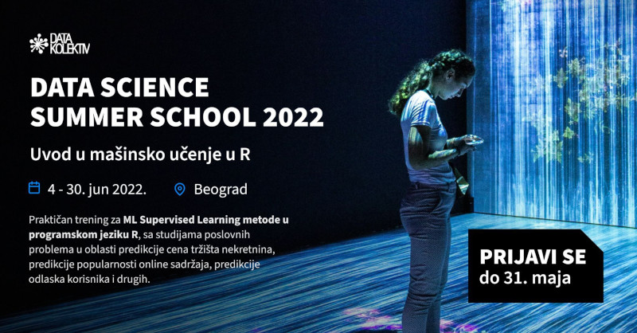

# **Uvod u mašinsko učenje u R**
## Jun 4 - 30, 2022, Startit centar, Beograd + Online

---

### **>> Prijavite se na: [hello@datakolektiv.com](mailto:hello@datakolektiv.com) <<**

 

## **Jedini kurs ovog tipa u Srbiji**

Koliko mi znamo, ovaj specijalizovan kurs u programskom jeziku R za mašinsko učenje **je jedinstven u Srbiji**. 

Zašto baš R? U odnosu na druge programske jezike, ima daleko bogatiji ekosistem paketa za ML, i često ćete biti u situaciji kada će vam upravo ova znanja dati kompetitivnu prednost da rešite problem na kome radite brže i bolje nego u nekom drugom jeziku. 

## **ML/Data Science su beskrajno interesantni (i perspektivni)**

U ovim oblastima su dobri oni koji to mogu da zavole, koji imaju inženjerski pristup, radoznali su i žele da oslobode vrednost ogromnih količina podataka koje svet kreira svakodnevno. ML je već centralni deo mnogih proizvoda u IT-u uopšte, a odavno je sržni deo analitike poslovanja. 

Jaz između potražnje i ponude kvalifikovanog kadra na tržištu je **neverovatan**, što ovo čini **izvrsnim karijernim izborom**. Pogledajte koliko vremena ostaju otvoreni oglasi za poslove u Data Science pa ćete moći da zamislite koliko je teško naći pravu osobu za tako nešto.

## **~~Devet (9)~~ Šest (6) preostalih mesta — prijavite se na vreme**

Kako bi obuka bila kvalitetna odlučili smo se na mali broj polaznika — 12. Trenutno je preostalo **još 9 mesta**, ukoliko je ovo prava stvar za vas javite se čim pre, najkasnije do 31. maja 2022.

## **Više o kursu — šta će se raditi**

Kompletna obuka za ML metode nadgledanog učenja (Supervised Learning) u programskom jeziku R, sa studijama poslovnih problema u oblasti predikcije cena tržišta nekretnina, predikcije popularnosti online sadržaja, predikcije odlaska korisnika (churn) i drugih. Od linearne regresije do XGBoost modela - poznatog kao “švajcarski nož” za prediktivnu analitiku, pobednika mnogih Kaggle takmičenja, sve u jednom od danas deset najpopularnih programskih jezika, R - de facto lingua franca globalne Data Science zajednice. Trening je kompletno orijentisan na praksu pružajući “hands on knowledge” od strane Gorana S. Milovanovića, Senior Data Scientist i Phd sa više od dvadeset godina iskustva u modeliranju podataka, mašinskom učenju i edukaciji.

## **Cena**

Cena je **samo 1000€** u dinarskoj protivvrednosti, moguće je plaćanje preko računa, i od strane fizičkih lica (uz mogućnost plaćanja u 2 rate). 

## **PROGRAM**

### Nedelja 1.

- **Uživo: subota, 4. jun, 09:00 - 18:00, Startit centar, Beograd**
   - 09:00 - 12:30. Uvod u programski jezik R: strukture podataka, data.frame klasa, I/O operacije, kontrola toka.
   - 14:30 - 18:00. {tidyverse} pristup R programiranju: paketi {dplyr} i {tidyr} za rukovanje podacima.
- **Asinhrono (Slack, GitHub), ponedeljak, 6. jun - petak, 10. Jun**
   - Vizuelizacija podataka u industrijskom standardu {ggplot2}.
   - Čišćenje i transformacija podataka (data wrangling) u paketima {stringr}, {dplyr} i {tidyr}.
Eksplorativna analiza podataka (EDA) u R.

### Nedelja 2.

- **Uživo: subota, 11. jun, 09:00 - 18:00, Startit centar, Beograd**
   - 09:00 - 12:30. Linearna i multipla linearna regresija. 
   - 14:30 - 18:00. Binomijalna logistička i multinomijalna logistička regresija za klasifikacione probleme.
- **Asinhrono (Slack, GitHub), ponedeljak, 13. jun - petak, 17. Jun**
   - Studija slučaja 1: Predikcija odlaska korisnika (churn prediction).
   - Problem ovefita 1: Regularizacija linearnog regresionog modela.

### Nedelja 3.

- **Uživo: subota, 18. jun, 09:00 - 18:00, Startit centar, Beograd**
   - 09:00 - 12:30. Kros-validacija i regularizacija klasifikacionih modela; selekcija klasifikacionih modela (ROC analiza).
   - 14:30 - 18:00. Drveta odlučivanja (CART: Decision Tree Model).
- **Asinhrono (Slack, GitHub), ponedeljak, 20. jun - petak, 24. Jun**
   - Studija slučaja 2: Predikcija cena nekretnina.
   - Problem ovefita 2: Kros-validacija regresionih modela.

### Nedelja 4.

- **Uživo: subota, 25. jun, 09:00 - 18:00, Startit centar, Beograd**
   - 09:00 - 12:30. Random Forest model za regresione i klasifikacione probleme
   - 14:30 - 18:00. Gradient Boosting: XGBoost model za regresione i klasifikacione probleme
- **Asinhrono (Slack, GitHub), ponedeljak, 27. jun - četvrtak, 30. Jun**
   - Studija slučaja 3: Predikcija popularnosti online sadržaja.
   - Studija slučaja 4: Kompletan tok pripreme podataka i fine-tuning XGBoost modela za regresione i klasifikacione probleme.

## MENTOR

[Goran S. Milovanović, PhD](https://www.linkedin.com/in/gmilovanovic/), je Senior Data Scientist i Phd sa velikim iskustvom u fundamentalnim i primenjenim istraživanjima, istraživanjima tržišta, oblasti pronalaženja informacija (*Information Retrieval*), izveštavanju, vizuelizaciji, i vođenju Data Science projekata. Goran vodi malu konsultantsku kuću [DataKolektiv](http://www.datakolektiv.com/), u Beogradu, Srbija, od 2017, a od januara 2022. radi kao Senior Data Scientist u sprsko-holandskom startapu [Smartocto](https://smartocto.com/) na problemima predikcije popularnosti online sadržaja.

**Kontak:** [goran.milovanovic@datakolektiv.com](mailto: goran.milovanovic@datakolektiv.com)
  
**DataKolektiv Tech Stack**

Uglavnom [R](https://www.r-project.org/about.html), ali ceo zoo bi obuhvatao:

- R: 
  - [Shiny](https://shiny.rstudio.com/), [R Markdown](https://rmarkdown.rstudio.com/) - ili [Open Source Shiny Server](https://rstudio.com/products/shiny/download-server/), ili ravno u produkciju sa [golem](https://github.com/ThinkR-open/golem) skalirajući sisteme sa [ShinyProxy](https://www.shinyproxy.io/) i [Docker](https://www.docker.com/); 
  - vizuelizacije: [ggplot2](https://ggplot2.tidyverse.org/), [Bokeh](https://hafen.github.io/rbokeh/), [Plotly](https://plotly.com/), [VisNetwork](https://datastorm-open.github.io/visNetwork/), [igraph](https://igraph.org/r/);
  - Backend/ML: [data.table](https://cran.r-project.org/web/packages/data.table/vignettes/datatable-intro.html), [text2vec](http://text2vec.org/), [maptpx](https://github.com/TaddyLab/maptpx), [Rtsne](https://github.com/jkrijthe/Rtsne), [XGBoost](https://xgboost.readthedocs.io/en/latest/), [Matrix](https://cran.r-project.org/web/packages/Matrix/index.html), [mclust](https://cran.r-project.org/web/packages/mclust/vignettes/mclust.html), [glmnet](https://glmnet.stanford.edu/articles/glmnet.html) i verovatno još mnogo toga;  
- [Python](https://www.python.org/)/[Pyspark](https://spark.apache.org/docs/latest/api/python/index.html)/[Apache Spark](https://spark.apache.org/), [scikit-learn](https://scikit-learn.org/stable/) [Hadoop](https://hadoop.apache.org/)/[HiveQL](https://en.wikipedia.org/wiki/Apache_Hive), and [MariaDB](https://mariadb.org/), [PostgreSQL](https://www.postgresql.org/);
- [XML](https://www.w3.org/XML/), [JSON](https://www.json.org/json-en.html), [RDF](https://www.w3.org/RDF/);
- naravno da je [RStudio](https://rstudio.com/) naš omiljeni IDE, ali i [Visual Studio Code](https://code.visualstudio.com/) kao i ponekad [PyCharm](https://www.jetbrains.com/pycharm/).

**GitHub**

- Goran: [github.com/GoranMilovanovic](https://github.com/GoranMilovanovic)
- DataKolektiv: [github.com/datakolektiv](https://github.com/datakolektiv)
