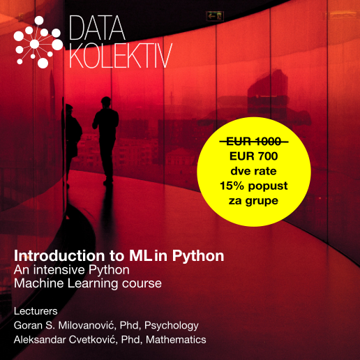

# **Uvod u mašinsko učenje (ML) u Python**
## Decembar 2022, Startit centar Beograd 
## Online Slack/GitHub

---

### **>> Prijavite se na: [hello@datakolektiv.com](mailto:hello@datakolektiv.com) <<**

### **>> Prijavite se na: [hello@datakolektiv.com](mailto:hello@datakolektiv.com) <<**

# Cena **~~1000€~~ 700€**

---

## **Plan rada**

#### **Sesije uživo se održavaju subotama, 3, 10, 17, i 24. decembra 2022. u prostorijama [Startit centra Beograd, Savska 5, 11000 Beograd](https://startit.rs/beograd/), 09:00 - 18:00 sa pauzom za ručak, dok radnim danima (ponedeljak - petak) radimo asihrono preko Slack platforme i na GitHub gde vodimo vaš samostalan rad, delimo vežbe i projekte, organizujemo 1:1 konsultacije, video calls kada su potrebni, i gde smo u realnom vremenu dostupni za pomoć, savete, i da odgovorimo na sva (baš sva) vaša pitanja.**

---

## **Izvesno onaj kurs ML u Python koji ste oduvek tražili**

Prema svim saznanjima koje imamo, ovaj intenzivan kurs mašinskog učenja (ML) u Python za **je jedinstven u Srbiji**: prilagođen Python programerima koji poznaju makar osnove ovog programskog jezika i imaju makar elementarno (fakultetsko) predznanje iz teorije verovatnoće, naš **Uvod u mašinsko učenje (ML) u Python** pruža priliku onima koji su spremni da posvete mesec mašinskom učenju da kroz intenzivan, neposredan rad sa dvojicom eksperata u DataKolektiv savladaju rad u suštinskim paketima za ML i Data Science: [Numpy](https://numpy.org/) i [Scipy](https://scipy.org/), [Pandas](https://pandas.pydata.org/), [Statsmodels](https://www.statsmodels.org/stable/index.html), [Scikit Learn](https://scikit-learn.org/stable/), [Matplotlib](https://matplotlib.org/), [Seaborn](https://seaborn.pydata.org/), i [Plotly](https://plotly.com/). 

---

## **ML/Data Science su beskrajno interesantni (i perspektivni)**

U ovim oblastima su dobri oni koji mogu da ih zavole, znaju da uzmu inženjerski pristup problemima, radoznali su i žele da oslobode vrednost ogromnih količina podataka koje svet kreira svakodnevno. ML je već centralni deo mnogih proizvoda u IT-u uopšte, a odavno je sržni deo analitike poslovanja. 

Jaz između potražnje i ponude kvalifikovanog kadra na tržištu je **neverovatan**, što ovo čini **izvrsnim karijernim izborom**. Pogledajte koliko vremena ostaju otvoreni oglasi za poslove u Data Science pa ćete moći da zamislite koliko je teško naći pravu osobu za tako nešto.

---

## **[!!!]Ograničen broj polaznika i personalizacija**

DataKolektiv **nikada** ne radi sa velikim brojem polaznika, zato što tokom učešća na našim kursevima **personalizujemo rad prema vašim potrebama!** To garantuje da ćete sa nama provesti dovoljno vremena u radu i moći da diskutujete uživo i online **baš sva pitanja koja budete imali**, razmenite ideje sa nama - i čak kodirate zajedno sa nama u pair-programming sesijama. Na primer, tokom ovog kursa imaćemo četiri celodnevne sesije uživo, ali smo pored toga radnim danima praktično non-stop na raspolaganju online na Slack kanalu kursa i GitHub gde radimo *code review* za vas, savetujemo vas, delimo dopunske materijale, organizujemo 1:1 konsultacije na Google Meet kada je to potrebno, i naravno odgovaramo na baš, baš sva vaša pitanja! :-) **DataKolektiv radi već godinama po ovoj metodologiji i to nam omogućava da se svakom polazniku posvetimo maksimalno i precizno u skladu sa njegovim potrebama!**

---

## **Šta radimo konkretno?**

Kompletna obuka za ML metode nadgledanog učenja (Supervised Learning) u programskom jeziku Python, sa studijama poslovnih problema u oblasti predikcije cena tržišta nekretnina, predikcije popularnosti online sadržaja, predikcije odlaska korisnika (churn) i drugih. Od linearne regresije do XGBoost modela - poznatog kao “švajcarski nož” za prediktivnu analitiku, pobednika mnogih Kaggle takmičenja, sve u danas ubedljivo najpopularnijem programskom jeziku, Python. 

**U DataKolektiv smo prilično pragmatični i naš pristup je kompletno, totalno praktičan: cilj nam je da vi na kraju kursa jednostavno znate da neki problem pred sobom rešite! Matematičke osnove predajemo, ali isključivo do nivoa koji je neophodan za razumevanje modeliranja u ML i Data Science; sve ostalo učite tako što učite da to nešto isprogramirate, a vaše znanje razvijate i testirate na praktičnim primerima i diskutujete sa nama. Mi smo iskusna konsultanstka kuća u ML i Data Science, pružali smo usluge nekim od najvećih provajdera podataka na svetu uopšte i vodećim evropskim bankama, i kada učite sa nama, učite isto ono što mi radimo za naše klijente i naplaćujemo im: pristup je prilično "odmah u vodu, i plivaj" (uz našu pomoć).**

---

## **Predavači**

[Dr Goran S. Milovanović](https://www.linkedin.com/in/gmilovanovic/). Studirao matematiku, filozofiju, i psihologiju, na Beogradskom i Njujorškom (NYU) univerzitetu, doktorirao psihologiju. Programer od svoje desete godine, objavio prvi naučni rad sa dvadeset godina, sarađivao sa vrhunskim kognitivnim naučnicima i objavljivao radove citirane u Stevens' Handbook of Experimental Psychology. Višegodišnje iskustvo u analitici i mašinskom učenju na nekim od najvećih sistema podataka u svetu (Wikidata), član programskih odbora evropskih konferencija u Data Science. Kao individualni konsultant, u saradnji sa američkim edu startups, i sa DataKolektiv obrazovao je desetine ljudi za rad u Data Science i ML.

[Dr Aleksandar Cvetković](https://www.linkedin.com/in/alegzndr/). Završio doktorske studije primenjene matematike u Italiji (GSSI – Lakvila, SISSA – Trst) baveći se naučno-istraživačkim radom u oblasti kontrole i optimizacije. Autor i koautor nekoliko naučnih radova objavljivanih u vodećim internacionalnim časopisima.
Višegodišnje iskustvo u ML industriji i edukaciji, sa fokusom na mašinsko učenje, 3D kompjutersko viđenje, grafovske neuronske mreže i ubrzavanje rada ML algoritama na hardveru, trenutno u gejming industriji.

---

## **Program rada**

### Nedelja 1.

- **Subota, 3. Decembar, 09:00 - 18:00 CET, Startit centar, Beograd**
   - 09:00 - 12:30. Uvod u Numpy i Pandas pakete: tipovi podataka, vektorizacija, rad sa `pandas.DataFrame` klasom.
   - 14:30 - 18:00. Organizacija i uređenje podataka (i.e. *data wrangling*) u Pandas za analitiku i mašinsko učenje. Uvod u teoriju verovatnoće i matematičku statistiku u Numpy i Scipy.
- **Asinhrono (Slack, GitHub), ponedeljak, 5. decembar - petak, 9. decembar**
   - Vizuelizacija podataka u Matplotlib i Seaborn paketima
   - Exploratory Data Analysis (EDA) u Pandas
   - Metoda najmanjih kvadrata i optimizacija jednostavnog linearnog modela.

### Nedelja 2.

- **Subota 10. decembar, 09:00 - 18:00 CET, Startit centar, Beograd**
   - 09:00 - 12:30. Linearna i multipla linearna regresija
   - 14:30 - 18:00. Uvod u generalizovane linearne model: binomijalna logistička i multinomijalna logistička regresija za klasifikacione probleme
- **Asinhrono (Slack, GitHub), ponedeljak, 12. decembar - petak, 16. June**
   - Studija slučaja 1: Churn Prediction
   - Kako kontrolisati overfit modela 1: regularizacija linearnih i generalizovanih linearnih modela.

### Nedelja 3.

- **Subota, 18. June, 09:00 - 18:00 CET, Startit centar, Beograd**
   - 09:00 - 12:30. Kros-validacija i regularizacija u klasifikacionim problemima; selekcija modela (ROC analiza)
   - 14:30 - 18:00. Drveta odlučivanja (CART)
- **Asinhrono (Slack, GitHub), ponedeljak, 19. decembar - petak, 23. decembar**
   - Studija slučaja 2: Price Prediction in the Real Estate Market
   - Kako kontrolisati overfit modela 2: kros-validacija i regularizacija u regresionim problemima.
   
### Nedelja 4.

- **Subota, 24. decembar, 09:00 - 18:00 CET, Startit centar, Beograd**
   - 09:00 - 12:30. Random Forest model za regresione i klasifikacione probleme
   - 14:30 - 18:00. Gradient Boosting: XGBoost model za regresione i klasifikacione probleme
- **Asinhrono (Slack, GitHub), ponedeljak, 26. decembar - petak, 30. decembar**
   - Studija slučaja 3: Web Content Popularity Prediction
   - Studija slučaja 4: Kompletna postavka modela i fine-tuning parametera sa XGBoost algortimom za regresione i klasifikacione probleme.

---

## **Predznanje**

U pitanju je *intenzivan kurs ML u Python*, tako da... 

- ako imate predznanje u oblasti statistike, bilo bi dobro da je to makar uvodni fakultetski kurs; mi ćemo sa vama obnoviti osnove teorije verovatnoće i statistike i pružiti vam materijale za vaš pregled osnova tih oblasti u meri dovoljnoj da pratite kurs;

- ne bi bilo loše da se podsetite šta su funkcije, šta je maksimum a šta minimum neke funkcije, kako se crtaju njihovi grafikoni i sl, ali za to ćete imati pregledne online materijale i nas da ponovimo nephodno;

- treba da imate makar elementarno poznavanje programskog jezika Python: kontrolu toka, tipove podataka, klase, razumevanje šta je komprehenzija liste, i sl; ponovo, i za to ćemo imati materijale za pregled, ali ovaj kurs ne bi trebalo da bude prilika kada prvi put u životu vidite programski jezik Python.

---

## **Cena**

Cena je **samo 700€** u dinarskoj protivvrednosti, za fizička lica je moguće plaćanje u 2 rate, grupe polaznika dobijaju popust od **15%** (napomenite u vašim prijavama da se prijavljujete kao grupa ukoliko ste kompanija ili organizacija).

---

## **Prijava**

### **>> Prijavite se na: [hello@datakolektiv.com](mailto:hello@datakolektiv.com) <<**

---

## **Gde?**

Sesije uživo, koje se održavaju subotama u decembru, biće u prostorijama Startit centra Beograd, Savska 5, 11000 Beograd.

  

   <iframe src="https://www.google.com/maps/embed?pb=!1m18!1m12!1m3!1d2830.718369297101!2d20.453312815171934!3d44.80692788507961!2m3!1f0!2f0!3f0!3m2!1i1024!2i768!4f13.1!3m3!1m2!1s0x475a7aaa0756e81f%3A0x1e47be2a38dbf0ee!2sStartit%20Centar%20Beograd!5e0!3m2!1ssr!2srs!4v1668206796153!5m2!1ssr!2srs" width="100%" height="450" style="border:0;" allowfullscreen="" loading="lazy" referrerpolicy="no-referrer-when-downgrade"></iframe>
   

