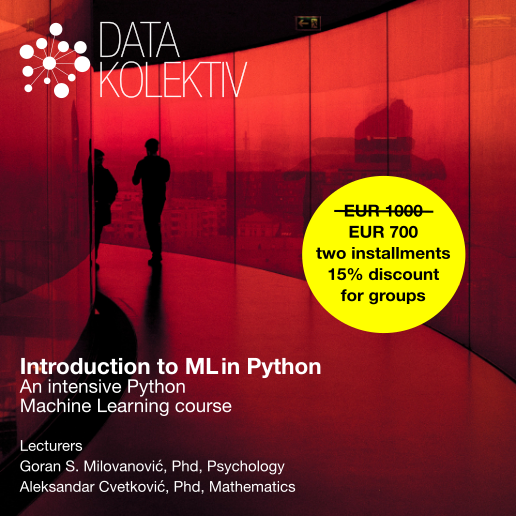
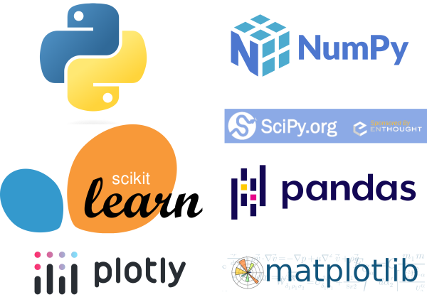

# **Introduction to Machine Learning (ML) in Python**
## December 2022, Startit center Belgrade 
## Online Slack/GitHub

---

### **>> Sign up e-mail to: [hello@datakolektiv.com](mailto:hello@datakolektiv.com) <<**

### **>> Sign up by e-mail to: [hello@datakolektiv.com](mailto:hello@datakolektiv.com) <<**

# Price **~~1000€~~ 700€**

---

## **Schedule**

#### **The live sessions will be held on Saturdays, December 3, 10, 17, and 24, 2022 in the [Startit Center Belgrade, Savska 5, 11000 Belgrade](https://startit.rs/beograd/), 9:00 a.m. - 6:00 p.m. 00 with a lunch break, while on weekdays (Monday - Friday) we work asynchronously via the Slack platform and on GitHub where we manage your independent coursework, share exercises and projects, organize 1:1 consultations, video calls when needed, and where we are available in real-time for help, advice, and to answer all (absolutely all) of your questions.
**

---

## **Certainly that ML in Python course you've always been looking for**

According to all the information we have, this intensive machine learning (ML) course in Python **is unique in Serbia**: adapted to Python programmers who know at least the basics of this programming language and have at least elementary (Stats 101 college level) prior knowledge of probability theory, our **Introduction to Machine Learning (ML) in Python** provides an opportunity for those who are ready to dedicate a month to Machine Learning to master the essential packages for ML and Data Science through intensive, direct work with two DataKolektiv experts: [Numpy](https ://numpy.org/) and [Scipy](https://scipy.org/), [Pandas](https://pandas.pydata.org/), [Statsmodels](https://www.statsmodels .org/stable/index.html), [Scikit Learn](https://scikit-learn.org/stable/), [Matplotlib](https://matplotlib.org/), [Seaborn](https:/ /seaborn.pydata.org/), and [Plotly](https://plotly.com/).

---

## **ML/Data Science are endlessly interesting (and promising)**

Those who are good at these fields are those who can love them, know how to take an engineering approach to problems, are curious and want to unlock the value of the huge amounts of data the world creates every day. ML is already a central part of many products in IT in general, and has long been a core part of business analytics.

The gap between demand and supply of qualified personnel in the market is **unbelievable**, which makes this an **excellent career choice**. Take a look at how long data science job postings stay open and you'll be able to imagine how difficult it is to find the right person for such a job.

---

## **[!!!]Limited number of participants and personalization**

DataCollective **never** works with a large number of participants, because during participation in our courses we **personalize the work according to your needs!** This guarantees that you will spend enough time working with us and be able to discuss live and online **any questions you may have**, exchange ideas with us - and even code together with us in pair-programming sessions. For example, during this course we will have four full-day live sessions, but in addition we are available practically non-stop on weekdays online on the course's Slack channel and GitHub where we do *code review* for you, advise you, share supplementary materials, organize 1: 1 consultation on Google Meet when necessary, and of course we answer all your questions! :-) **DataKolectiv has been working for years according to this methodology, and this allows us to dedicate ourselves to each participant as much as possible and precisely in accordance with their needs!**

---

## **What do we do specifically?**

Complete training for ML methods of supervised learning in the Python programming language, with studies of business problems in the area of real estate market price prediction, online content popularity prediction, churn prediction and others. From linear regression to the XGBoost model - known as the "Swiss army knife" for predictive analytics, winner of many Kaggle competitions, all in today's by far the most popular programming language, Python.

**At DataKolectiv, we are quite pragmatic and our approach is completely, totally practical: our goal is that at the end of the course you simply know how to solve a problem in front of you! We teach mathematical basics, but only to the level that is necessary for understanding modeling in ML and Data Science; everything else you learn by learning to program something, and you develop and test your knowledge on practical examples and discuss with us. We are an experienced consultancy in ML and Data Science, we have served some of the largest data providers in the world in general and leading European banks, and when you learn with us, you learn the same thing that we do for our clients and charge them: the approach is quite "immediately jump into the water - and swim!" (with our help).**

---

## **Lecturers**

[Dr. Goran S. Milovanovic](https://www.linkedin.com/in/gmilovanovic/). Studied mathematics, philosophy, and psychology at University of Belgrade and New York University (NYU), received a doctorate in psychology. A programmer since the age of ten, he published his first scientific paper at the age of twenty, collaborated with top cognitive scientists and published papers cited in Stevens' Handbook of Experimental Psychology. Many years of experience in analytics and machine learning on some of the largest data systems in the world (Wikidata), member of the program boards of European conferences in Data Science. As an individual consultant, in cooperation with American edu startups, and with DataKolektiv, he trained dozens of people to work in Data Science and ML.

[Dr. Aleksandar Cvetković](https://www.linkedin.com/in/alegzndr/). Completed doctoral studies in applied mathematics in Italy (GSSI - Lakvila, SISSA - Trieste) doing scientific research in the field of control and optimization. Author and co-author of several scientific papers published in leading international journals. Aleksandar has many years of experience in the ML industry and education, with a focus on machine learning, 3D computer vision, graph neural networks and hardware acceleration of ML algorithms, currently in the gaming industry.

---

## **Schedule Details**

### Week 1.

- **Saturday, December 3, 09:00 - 18:00 CET, Startit center, Belgrade**
   - 09:00 - 12:30. Introduction to Numpy and Pandas packages: data types, vectorization, working with `pandas.DataFrame` class.
   - 14:30 - 18:00. Data organization and arrangement (i.e. *data wrangling*) in Pandas for analytics and machine learning. An introduction to probability theory and mathematical statistics in Numpy and Scipy.
- **Asynchronous (Slack, GitHub), Monday, December 5 - Friday, December 9**
   - Data visualization in Matplotlib and Seaborn packages
   - Exploratory Data Analysis (EDA) in Pandas
   - The method of least squares and optimization of a simple linear model.

### Week 2.

- **Saturday December 10, 09:00 - 18:00 CET, Startit centar, Belgrade**
   - 09:00 - 12:30. Linear and multiple linear regression
   - 14:30 - 18:00. Introduction to generalized linear models: binomial logistic and multinomial logistic regression for classification problems
- **Asynchronous (Slack, GitHub), Monday, December 12 - Friday, June 16**
   - Case Study 1: Churn Prediction
   - How to control model overfit 1: regularization of linear and generalized linear models.

### Week 3.

- **Saturday, June 18, 09:00 - 18:00 CET, Startit centar, Belgrade**
   - 09:00 - 12:30. Cross-validation and regularization in classification problems; model selection (ROC analysis)
   - 14:30 - 18:00. Decision Tree (CART)
- **Asynchronous (Slack, GitHub), Monday, December 19 - Friday, December 23**
   - Case study 2: Price Prediction in the Real Estate Market
   - How to control overfit of model 2: cross-validation and regularization in regression problems.
   
### Week 4.

- **Saturday, December 24, 09:00 - 18:00 CET, Startit centar, Belgrade**
   - 09:00 - 12:30. Random Forest model for regression and classification problems
   - 14:30 - 18:00. Gradient Boosting: An XGBoost Model for Regression and Classification Problems
- **Asynchronous (Slack, GitHub), Monday, December 26 - Friday, December 30**
   - Case Study 3: Web Content Popularity Prediction
   - Case study 4: Complete model setup and fine-tuning parameters with the XGBoost algorithm for regression and classification problems.

---

## **Prerequisites**

it's an *intensive ML in Python course*, so...

- if you have prior knowledge in the field of statistics, it would be good if it was at least an introductory college course; we will refresh with you the basics of probability theory and statistics and provide you with materials for your review of the basics of those areas to the extent sufficient to follow the course;

- it would not be bad to remind yourself what functions are, what is the maximum and what is the minimum of some functions, how to draw their graphs, etc., but for that you will have clear online materials and we will repeat the necessary;

- you should have at least elementary, working knowledge of the Python programming language: flow control, data types, classes, understanding what list comprehension is, etc.; again, and we'll have review materials for that, but this course shouldn't be your first time seeing the Python programming language.

---

## **Price**

The price is **only €700** in dinar equivalent, for individual learners it is possible to pay in 2 installments, groups of participants receive a discount of **15%** (note in your applications that you are applying as a group if you are a company or organization) .

---

## **Sign up!**

### **>> Sign up via e-mail: [hello@datakolektiv.com](mailto:hello@datakolektiv.com) <<**

---

## **Wher?**

The live sessions, which are held on Saturdays in December, will be in the premises of Startit center Belgrade, Savska 5, 11000 Belgrade.

  

   <iframe src="https://www.google.com/maps/embed?pb=!1m18!1m12!1m3!1d2830.718369297101!2d20.453312815171934!3d44.80692788507961!2m3!1f0!2f0!3f0!3m2!1i1024!2i768!4f13.1!3m3!1m2!1s0x475a7aaa0756e81f%3A0x1e47be2a38dbf0ee!2sStartit%20Centar%20Beograd!5e0!3m2!1ssr!2srs!4v1668206796153!5m2!1ssr!2srs" width="100%" height="450" style="border:0;" allowfullscreen="" loading="lazy" referrerpolicy="no-referrer-when-downgrade"></iframe>
   

