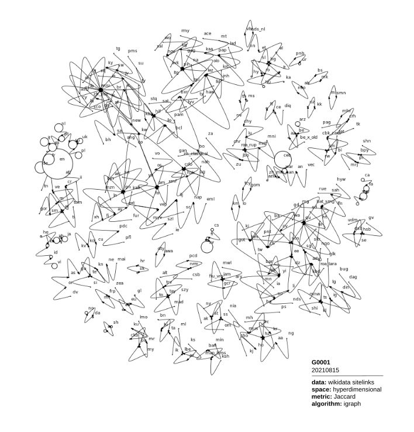
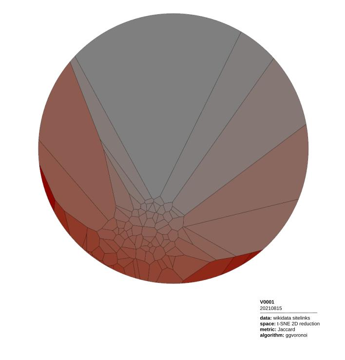
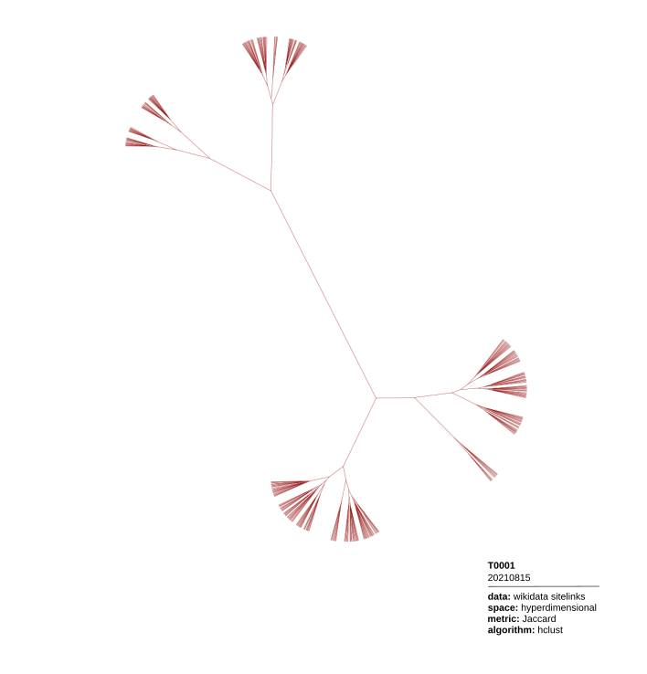
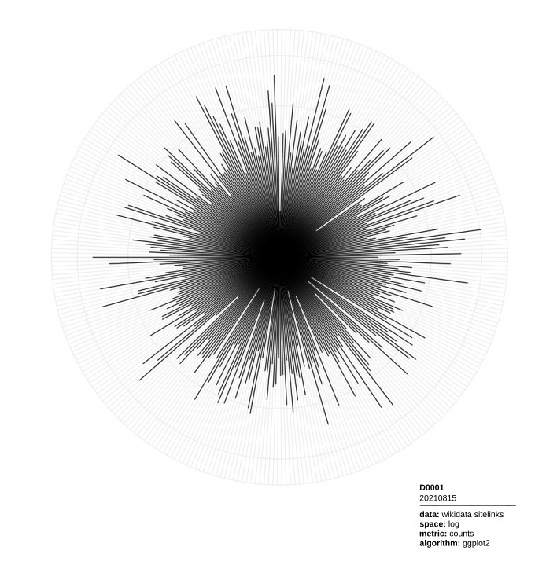

&nbsp;&nbsp;

**Do you enjoy patterns in nature, society, and in artifacts? We do.**

If you are a business entity or an organization interested to pursue research collaborations on problems in the areas of Neurosymbolic AI, Decision Making (especially if your interests lie in Choice Under Risk and Uncertainty and Behavioral Economics in general), Causal Networks and the discovery of causal relationships in statistical data, get in touch. Immediately.

