[](https://www.linkedin.com/in/gmilovanovic/)

#### A selection of our keynotes, talks, interviews w. [Goran S. Milovanovic](https://www.linkedin.com/in/gmilovanovic/), public debates, workshops, and meetups.

### Machine Learning Conference 2025, Subotica, "Separating Signal from Noise: The Truth About GenAI Startup Success"

```{r echo = FALSE}
library(vembedr)
embed_url("https://youtu.be/CGy16B2bQXU?si=fhgiptKKe2H4robZ&t=12625") %>%
  use_bs_responsive()
```

### Guest appearance on the Pojačalo podcast with Ivan Minic (Pojačalo podcast EP 258).

```{r echo = FALSE}
library(vembedr)
embed_url("https://www.youtube.com/watch?v=ggtP1t6ZFNM") %>%
  use_bs_responsive()
```

### Second guest appearance on the Pojačalo podcast with Ivan Minic (Pojačalo podcast EP 258).

```{r echo = FALSE}
library(vembedr)
embed_url("https://www.youtube.com/watch?v=7petnBICCpU") %>%
  use_bs_responsive()
```

### Data Science Conference Europe 2023: Decoding AI Landscape: Business, Market Trends, and Risks | Goran S. Milovanovic | DSC Europe 23

[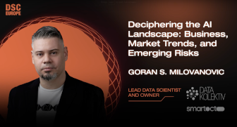](https://youtu.be/ufpYgTnSbPE?si=t9__1meQInZk4uaq)

It was already the third day, November 23, since the beginning and the conference was, naturally, losing momentum. It was an evening slot and the audience was already dispersing. I had been coughing since before November 20, which would extend to two months of coughing, and I barely had the strength to speak. I was well prepared, had excellent slides, but nothing else promised that I could deliver a good speech. For the most part, I read the first half of the speech. Again, I don't remember ever having such a good, so fulfilling and meaningful discussion with the audience as I did during this speech, which lasted all 27 minutes of this keynote I gave at the Data Science Conference Europe 2023. Thank you everyone! Finally, the video: [Decoding AI Landscape: Business, Market Trends, and Risks | DSC Europe 23](https://youtu.be/ufpYgTnSbPE?si=t9__1meQInZk4uaq).

- Slides: [Decoding AI Landscape: Business, Market Trends, and Risks](DSCEurope2023_Milovanovic_Keynote.pdf)

---

### Webit 2023: Exploring the Potential of Generative AI in Digital Analytics (Webit Summer Edition 2023 recording)

[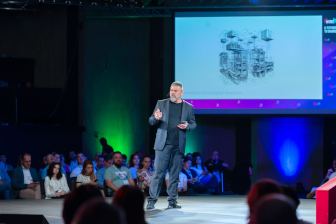](https://www.youtube.com/watch?v=D1jvrcXsYdM)

My keynote *Exploring the Potential of Generative AI in Digital Analytics*, Webit Summer Edition 2023, Sofia, NDK. At the kind invitation of the organizers of the Webit 2023 conference in Sofia, I discussed the potential of modern generative AI systems in digital analytics. I pay special attention to understanding the process of data generation in a user ecosystem that is all supported by generative AI systems directly or through applications, as well as the significance of synthetic data in analytics. My conclusions suggest that the study of a mix of synthetic and human data is inevitable in the future of digital analytics, and that it doesn't necessarily compromise analytical conclusions as much as is commonly thought today.

- Slides: [Exploring the Potential of Generative AI in Digital Analytics](Milovanovic_Webit2023.pdf)

- A full synopsis of the Keynote is available on LinkedIn: [Exploring the Potential of Generative AI in Digital Analytics](https://www.linkedin.com/pulse/exploring-potential-generative-ai-digital-analytics-milovanovi%2525C4%252587-phd%3FtrackingId=15J3WXu0QkuEhDXofK0MQg%253D%253D/?trackingId=15J3WXu0QkuEhDXofK0MQg%3D%3D)

---

### ML on Open Data: The Wikidata Case  (Data Science Conference 2021 recording)

[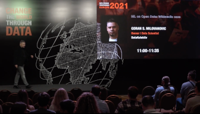](https://youtu.be/zg8cjXwg9SM?si=1otVyfHW-PLMakJ_)

https://datasciconference.com/

The last in a series of extensive, overview talks on data analytics infrastructure and machine learning with Wikidata, held in the fall of 2021 at the Data Science Conference Europe 2021, Belgrade, Crown Plaza. At that time, the Wikidata Analytics system was fully developed and provided Big Data analytics and machine learning on a vast amount of data, primarily through its leading application, the Wikidata Concepts Monitor. After five years with Wikidata (2017 - 2023), leading projects completely from the back-end, through ML and analytics, to Shiny in production independently, I decided it was time for the next step in my professional career, and that the intriguing and challenging Wikidata analytics should be left to the younger generation. This makes that talk very dear to my memory.

---

### Serbia prepares for the AI revolution, [a UNDP blog post on the conference co-organized by [MACHINERY](https://www.linkedin.com/company/machineryorg) and [UNDP Serbia](https://www.linkedin.com/company/undp-serbia/), Belgrade, April 28, 2023]

w. [Slobodan Markovic, Digital Advisor at UNDP](https://www.linkedin.com/in/smarkovic/)

[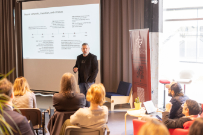](https://www.undp.org/serbia/blog/serbia-prepares-ai-revolution)

- Slides: [Generative AI in Action: Use Cases, Risks, and Future Prospects](machineryundpslides.pdf)

---

### Machine Learning Conference Palic 2023 :: Intro to ML Workshop [repo]

w. [Ilija Lazarevic](https://www.linkedin.com/in/ilijalazarevic/) and [Aleksandar Cvetkovic](https://www.linkedin.com/in/alegzndr/)

[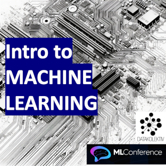](https://github.com/datakolektiv/MLConference_Palic2023)

On the zeroth day of the ML Conference Palic 2023, held at [InspiraHub](https://www.linkedin.com/company/inspira-hub/) in Subotica, the DataKolektiv team conducted a one-day, free workshop on Introduction to Machine Learning for a selected group of participants.

- Historical and conceptual introduction to Machine Learning (Goran S. Milovanovic)
- Introduction to vector arithmetic and data management in Python (Numpy, Pandas) (Ilija Lazarevic)
- Optimization of Linear Regression model (Goran S. Milovanovic)
- Linear associator and Backpropagation algorithm for a single-layer neural network (Aleksandar Cvetkovic).

The participants were provided with a comprehensive overview of the mathematical foundations of all the discussed models and Python code, enabling them to independently optimize these elementary models used in ML from scratch.

---

### Behavioural Decision Theory in R  (Data Science Conference Europe 2022, Tech Tutorial, recording)

[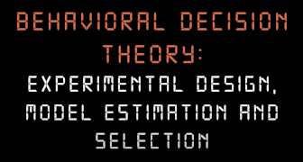](https://www.youtube.com/watch?v=1KZ8-B9uswo)

My **2022 Tech Tutorial on Behavioural Decision Theory and Risk Estimation in R**, encompassing SSE and MLE procedures to estimate parametric models of Expected Utility and Cumulative Prospect Theory. I have put some effort here to drive attention to the fact that (a) not just any data can be appropriately modelled by (b) just any math model (c) without taking into account the measurement procedures and the structure of the experimental design (that are, btw, formally one and the same thing) - a fact of which behavioural scientists are (or should be) quite aware of, but which is not in turn recognised and respected by practitioners in Data Science and Machine Learning in general. The respective GitHub repo is here: https://github.com/datakolektiv/DSC2022_BDT

---

### Learning Data Science through Education, Bootcamps & MOOC (aka Panel with 3 amigos)  (Data Science Conference 2022 recording)

w. prof. [Branko Uroševic, Program Director, Master in Computational Finance (MCF), School of Computing, Union University](https://www.linkedin.com/in/branko-urosevic-18586998/) and [Aleksandar Linc, Managing Director at Data Science Conference](https://www.linkedin.com/in/aleksandar-linc-djordjevic/)

[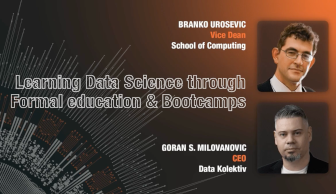](https://youtu.be/uiLoLXG_0sc?si=IXuLMSe4NGSbZZr1)

Branko, Aleks, and I discussing education in Data Science: the worth of a decent academic background and PhD studies (or not), how to approach your training and education plan, where science stops and engineering begins, and many other important things in one's path towards entering the market in Data Science, Machine Learning, and AI.

---

### The Lindy Effect in Wikidata User Retention (WikidataCon 2021 recording)

w. [Martin Gerlach](https://www.linkedin.com/in/martin-gerlach-164259139/) and [Jan Dittrich](https://www.linkedin.com/in/jandittrich/)

Jan, Martin, and I discussing a question of the distribution of [Wikidata](https://www.wikidata.org/wiki/Wikidata:Main_Page) user retention time in [WikidataCon 2021](https://www.wikidata.org/wiki/Wikidata:WikidataCon_2021). A classic churn problem approached from an elaborated perspective, testing the Power Law distributions on large data sets + some XGBoost predictive churn modeling. The code repo might be useful for anyone interested in churn problems in practice and MLE of Power Laws from empirical data. 

[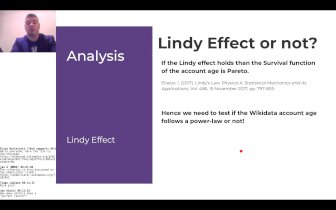](https://youtu.be/GSS5kviMkTM?si=7F4luByy0wMm7ioz)

- Code repo for this talk: [WD_UserRetention](https://github.com/wikimedia/analytics-wmde-WD-WikidataAdHocAnalytics/tree/master/WD_UserRetention)

- Slides: [The Lindy Effect in Wikidata User Retention](https://github.com/wikimedia/analytics-wmde-WD-WikidataAdHocAnalytics/blob/master/WD_UserRetention/_presentation/Lindy%20Effect%20and%20User%20Retention%20on%20Wikidata.pdf)

---

### Semantic Web in R for Data Scientists (eRum 2020 Workshop)

[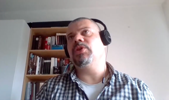](https://github.com/datakolektiv/e-Rum2020_SemanticWeb)

This workshop offered a hands-on approach to Semantic Web technologies in R by exemplifying how to work with [Wikidata](https://www.wikidata.org/wiki/Wikidata:Main_Page) and [DBpedia](https://www.dbpedia.org/) in different ways. We start simple (using the Wikidata API, for example) and then slowly progress towards more advanced topics (e.g. your first SPARQL query from R and why it is not as complicated as people think, matching your data set against Wikidata entities in order to enrich it, and similar). I will provide an introduction to Semantic Web on a conceptual level only so that participants will not need a full understanding of the related technical standards (RDF, different serializations, etc) to follow through. Finally, weshow how to process the Wikidata JSON dump from R for those interested to play big games with R and the Semantic Web. We might be playing around with some interactive graph visualizations during the workshop.

- Workshop repo: [WD_UserRetention](https://github.com/datakolektiv/e-Rum2020_SemanticWeb )


---

### Heapcon Light 2020: Structured semantic knowledge in Data Science (Hipkon Lajt 2020 recording, in Serbian)

[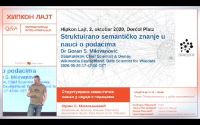](https://youtu.be/qq4BC5c1lt8?si=6IgnvTxrPeYfGnS2)

My talk on [Hipcon Light 2022](https://heapcon.io/2023/), Belgrade, Dorcol Platz, 2020: *Structured semantic knowledge in Data Science*. Structured semantic knowledge, represented by semantic graphs like the Wikidata or DBpedia knowledge bases, represents not only the most advanced foundation for the development of future artificial intelligence systems, but also an excellent support for enriching existing data sets in everyday work. Our topic is the mapping between two worlds: the world of knowledge representation through a semantic graph and the typical tabular data frame representation found in data science and the realm of relational databases. Our narrative will start from a standard tabular representation in the R and Python programming languages, which we will then transform into a semantic graph, and subsequently return to a well-known format through the SPARQL language. Along the way, we will discuss the RDF standard for semantic data and its well-known serializations (RDF/XML, Turtle, JSON-LD, N-triples, N-quads...). Anyone who believed that the Semantic Web was an exotic idea for the privileged (and who needs it?) will be able to relax: it's much easier and more accessible than you think.

---

### WikidataCon 2019: Wikidata Statistics: What, Where, and How (WikidataCon 2019 recording)

[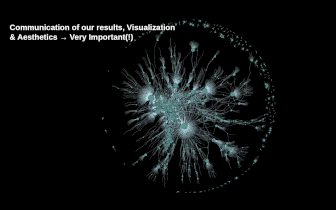](https://youtu.be/H1hUPmYgZQU?si=yh8t7qhM4N2GSa-M)

My talk on [WikidataCon 2019](https://www.wikidata.org/wiki/Wikidata:WikidataCon_2019), Berlin, Urania Berlin, 2019: *Wikidata Statistics: What, Where, and How*. I am presenting the whole Analytics and ML infrastructure for [Wikidata Analytics](https://github.com/wikimedia/analytics-wmde-WD-WikidataAnalytics) - a rather rare opportunity to get acquitted with how things in Data Science/ML/AI are done on (really!) Big Data from Data Engineering and ML to running Data Products in production.

- Slides: [GoranSMilovanovic WikidataCon 2019](https://commons.wikimedia.org/wiki/File:GoranSMilovanovic_WikidataCon_2019.pdf)

---

### MilanoR Meetup, June 25, 2019: Information Retrieval: Semantic Web Technologies and Wikidata from R, Microsoft House

[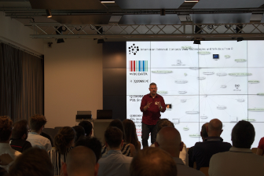](https://github.com/datakolektiv/MilanoR2019)

w. [Mike Page](https://www.linkedin.com/in/mikejohnpage/)

Material from my MilanoR Meetup, June 25, 2019, Milano, Microsoft House.

These notebooks are essenaitly educational material:

- The notebook A. Wikidata From R summarizes several methods to access Wikidata (and Wikipedia content) from R and provides a very light introduction to SPARQL;

- Notebooks 00 - 08 present a workflow where Wikidata is accessed from R to perform several typical tasks in Information Retrieval;

- The [newsrivr](https://github.com/MikeJohnPage/newsrivr) package to interface the NEWSRIVER API from R, developed by Michael John Page, is also introduced in this Meetup.

- Code Repo: [MilanoR2019](https://github.com/datakolektiv/MilanoR2019)

---

### eRum 2018: Wikidata Concepts Monitor: R in action across Big Data (eRum 2018 recording)

[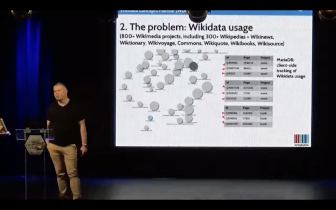](https://youtu.be/R4dKyqNyrL8?si=pLKa-uYeNiVwW4cH)

My talk on [European R Users Meeting eRum2018, Budapest](https://2018.erum.io/), Budapest, Akvarium Klub, May 16, 2018: *Wikidata Concepts Monitor: R in action across Big Data*. Wikidata, one of the most prominent Wikimedia projects nowadays, presents a formal ontology that adheres to the RDF standard. All Wikimedia projects (Wikipedia, Wiktionary, Wikivoyage, Wikimedia commons, etc) can reach out to and make use of Wikidata by relying on the features of MediaWiki and Wikibase. Currently, more than 800 Wikimedia websites - some of which are found among the most dynamic places online at all - maintain a client-side Wikidata usage tracking. The resulting data sets present a challenging Big Data problem that calls for SQL transfers to Hadoop via Apache Sqoop, massive HiveQL ETL operations and data wrangling in R just in order to enable for the tracking and analytics of individual Wikidata item usage statistics across the Wikimedia projects.

The Wikidata Concepts Monitor (WDCM) system was developed in R to orchestrate various technologies (SPARQL to access Wikidata, SQL, Apache Sqoop, Hive, and Spark) in order to provide for Wikidata usage tracking and analytics. The WDCM then takes a step beyond and performs machine learning (LDA, t-SNE) across the matrices that encompass Wikidata items and Wikimedia projects in order to gain insight into the distributive semantics (i.e. topic models, dimensionality reduction for similarity maps) of Wikidata usage. The system encompasses a set of Shiny dashboards where the results of the WDCM statistical machinery are visualized and tools for analytical work provided in order to help the understanding of the utterly complex social and behavioral phenomenon of Wikidata usage.

- [Wikitech: Wikidata Concepts Monitor (WDCM). The WDCM technical documentation](https://wikitech.wikimedia.org/wiki/Wikidata_Concepts_Monitor)

- [Wikidata Concepts Monitor (WDCM the WDCM Wikidata wiki project page](https://www.wikidata.org/wiki/Wikidata:Wikidata_Concepts_Monitor)

- Slides: [Wikidata Concepts Monitor: R in action across Big Data](https://commons.wikimedia.org/wiki/File:GMilovanovic_eRum2018.pdf)

---

### Wikidata and the Next Generation of the Web – Goran Milovanovic, Data Scientist for Wikidata (Interview) w. [Filip Milenkovic](https://www.linkedin.com/in/philipmilenkovic/) [Filip Never Stops, September 13, 2020]

[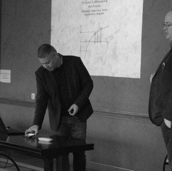](https://filipneverstops.com/2020/09/13/interview-wikidata-and-the-next-generation-of-the-web-goran-milovanovic-data-scientist-for-wikidata/)

An interview by Filip Milenkovic, 2020, on everything from Computational Cognitive Science, Semantic Web, to Wikidata and AI. "*Goran Milovanovic is one of the most knowledgeable people I know. I invited him to lecture about Data Science potential in the public administration at the policy conference that I organized five years ago. We remained friends and I enjoy talking with him about everything that has ever popped in the back of my head. Interested in early Internet development and the role of RAND in immediate postwar America? No worries, he’ll speak 15 minutes about it in one breath.*"

---

### From the Life of Wikidata w. Wikimedia Foundation [Wikimedia blog, 29 January 2018]

[](https://wikimediafoundation.org/news/2018/01/29/from-the-life-of-wikidata/)

A 2018. blog on Wikidata Analytics for [Wikimedia Foundation](https://wikimediafoundation.org/). [Wikidata](https://www.wikidata.org/wiki/Wikidata:Main_Page) is the central knowledge repository in the Wikimedia universe that now encompasses more than 300 free, online encyclopedias, and more than 800 projects in total. Why would anyone devoted to the representation of the sum of knowledge—which by its complexity must encompass different perspectives, interpretations, points of view—need a central repository like that? Simply because knowledge demands grounding in both logical and empirical truths, a set of constraints that define the limits of its power and usage.

---

### Introduction to R Course [Playlist] w. Startit [In Serbian, 2016 - 2022]

[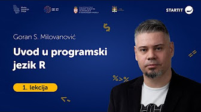](https://www.youtube.com/playlist?list=PLji_uE7buef9bugJOnn4vwef_rz46rQeh)

In the fall of 2022, we finally recorded my course "Introduction to R" in Serbian in collaboration with Startit Center. [Branko Kovač](https://www.linkedin.com/in/kovacbranko/) and I have been volunteering to teach this course since around 2015. Later on, I tried to align it more with the tidyverse approach to R programming and continued to volunteer to maintain it at Startit Centers in Belgrade and Novi Sad. This is a basic introduction to R programming for absolute beginners which covers the fundamentals of programming, emphasizes functional programming in R, and provides an introduction to tidyverse through ggplot2 and dplyr.

---

### Smartocto: What is the role of 'data' teams? w. [Netokracija](https://www.netokracija.rs/) [In Serbian, 2023]

[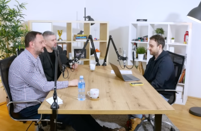](https://youtu.be/HuJ7L7qyHH4?si=1aRS4ym6i9dXC2HW)

w. [Ilija Šuša, CDO & Co-founder, Smartocto](https://www.linkedin.com/in/ilijasusa/)

An old friend of mine from the early days of the Serbian Data Science scene, my CDO Ilija Šuša, a mathematician and Data Engineer, and I, were guests at Netokracija's podcast focused mainly on the organization of data teams in companies and startups.  

---

### Job market in Data Science, ML, and AI in 2023: What changes can we expect? w. [Inspira Hub](https://https://inspirahub.rs/en/home/), Subotica, [ML Conference Palic](https://ml-conference.rs/) [In Serbian, 2023]

[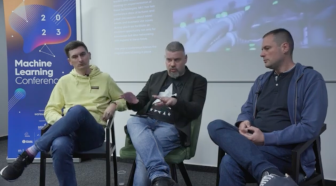](https://youtu.be/noU0vVxzTsU?si=4Y1wpdruFS0BYq96)

w. [Branko Kovač](https://www.linkedin.com/in/kovacbranko/) and [Nemanja Čukaric](https://www.linkedin.com/in/nemanja-cukaric/)

Branko, Nemanja, and I discussed the issues of the job market in Data Science, machine learning, and AI in 2023, focusing on changes caused by the economic crisis as much as the upcoming generative AI technologies in software engineering. We were hosted by the Inspira Hub in Subotica as part of the Machine Learning Conference Palic 2023. The discussion took place after [Aleks Cvetkovic](https://www.linkedin.com/in/alegzndr/), [Ilija Lazarevic](https://www.linkedin.com/in/ilijalazarevic/), and I held the "Day Zero" of the conference, providing a free [Introduction to Machine Learning](https://github.com/datakolektiv/MLConference_Palic2023) training in the Python programming language for a selected group of participants.

---

### DataScienceMeetup - R and Shiny in Information Retreival, Startit Centar, Belgrade, 2016 [In Serbian]

[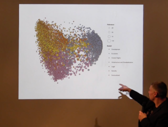](https://youtu.be/d3loi6ylUEI?si=d2_T2fSuLHacWeBY)

A recording from one of the first meet-ups in the Belgrade Data Science scene from 2016, Startit Center Belgrade, Savska 5. I spoke about the application of R and RStudio Shiny in the development of a complete Information Retrieval system and the use of the LDA topic model in analysis, prediction, and text classification in the IG Concepts system, which I developed for the international foundation DiploFoundation in 2015.

---

### Methods of distributional semantics in R, Startit Centar, Belgrade, 2016 [In Serbian]

[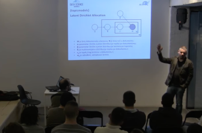](https://youtu.be/lCt4GNHGZkE?si=8n1DS-GYp8wRpOI6)

Another early recording from the Belgrade Data Science scene beginnings in Startit Center Belgrade, Savska 5, 2016. I spoke about the methods of distributional semantics in R, focusing on Latent Dirichlet Allocation. 

---

### Artificial intelligence, [Talas](https://talas.rs/category/vestacka-inteligencija/), [Column for Talas, In Serbian]

[](https://talas.rs/category/vestacka-inteligencija/)

My column dedicated to AI on the media portal Talas, in Serbian.

---

### Artificial intelligence won't replace you, but the one who knows how to use it will (interview), Netokracija, 16. 3. 2023. [In Serbian]

[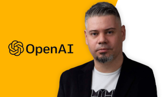](https://www.netokracija.rs/gpt-4-goran-milovanovic-205469)

Anstasija Uspenski interviewed me for Netokracija on the most recent develepments in Generative AI and the consequences for the job market.

---

### Analytics of digital lives (interview), VREME magazine 1421, 29. March 2018. [In Serbian]

[](https://www.vreme.com/svet/analitika-digitalnih-zivota/)

The Belgrade weekly magazine VREME interviewed me on the [Facebook–Cambridge Analytica data scandal](https://en.wikipedia.org/wiki/Facebook%E2%80%93Cambridge_Analytica_data_scandal).

---

### Internet Governance Forum: Identifying the Impact

[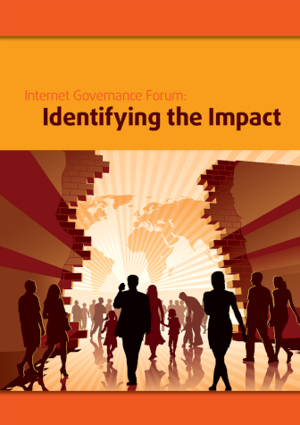](https://mcit.gov.eg/Upcont/Documents/Publications_21112019000_Internet_Governance_Forum_Identifying_the_Impact.pdf).

Published by [DiploFoundation](https://www.diplomacy.edu/)

In Partnership with:

- [AT&T](https://www.att.com/)
- [Arab Republic of Egypt Ministry of Communications and  Information Technology](https://mcit.gov.eg/)
- [Commonwealth Internet Governance Forum]()

As a Research Manager and Statistical Analyst for the **Internet Governance Forum: Identifying the Impact (ISBN 978-99932-53-21-1)** evaluation study, I have orchestrated a methodological and mainly quantitative approach to better understand the effects of this central diplomatic process in the Internet Governance arena.

--- 

### Book promotion "Thinking, Fast and Slow" by Daniel Kahneman, SKC, Delfi Bookstore, Belgrade, 26. June 2015 [In Serbian]


[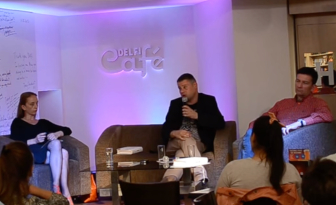](https://www.youtube.com/watch?v=89XEjqh7Wb0)

Book promotion "Thinking, Fast and Slow" by Daniel Kahneman, SKC, Delfi Bookstore, Belgrade, 26. June 2015.

Speakers about the book included Dr. Goran S. Milovanovic, Data Scientist, Dr. Dušan Pavlovic, professor at the Faculty of Political Sciences in Belgrade, and Ana Imširovic Đorđevic, the translator.

---

### Academic publications [ResearchGate]

[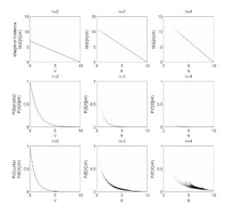](https://www.researchgate.net/profile/Goran-Milovanovic-2)

[Google Scholar](https://scholar.google.com/citations?user=YG1sO_EAAAAJ&hl=en)

I couldn't find a better place to host my past academic work (1993 - 2013, mainly) than [ResearchGate](https://www.researchgate.net/profile/Goran-Milovanovic-2). Excluding books, most of the work should be available in full-text. As an academic researcher in Cognitive Science, I was mainly focused on Categorization and Concept Learning, Semantics, Causality, and Decision Theory. 

